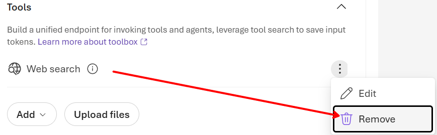
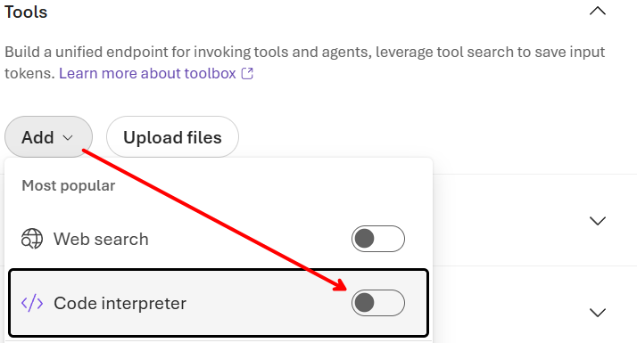
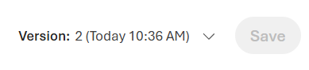

# Lab 1 — Create a prompt-based agent in Foundry

> *From an empty project to a working, tool-using agent in the portal.*

| | |
|---|---|
| **Audience** | CSA, developers, data scientists |
| **Duration** | 45–60 minutes |
| **Level** | Foundational (start here) |
| **You will build** | A named prompt-based agent with instructions and a built-in tool, tested in the playground |
| **Plane** | BUILD — Foundry Agent Service |

> [!NOTE]
> The instructor performs each step live; follow along on your own machine at your pace. Replace every `<angle-bracket placeholder>` with your own value. Where a step says *"copy from the portal"*, prefer the exact snippet Foundry generates for your resource.

---

## Prerequisites, as described at [environment_preparation](./../../environment_preparation.md)

- An Azure subscription and access to the Microsoft Foundry portal (`ai.azure.com`).
- A Foundry `project` (create one if needed — it is the container for models, tools, connections and identity).
- At least one chat/reasoning model deployed in the project (e.g. a GPT-family reasoning model).
- Role `Azure AI User` (or higher) on the project. If you can open the Agents area and see models, you are set.

## Learning objectives

- Create a prompt-based agent and understand its four parts: **model, instructions, tools, knowledge**.
- Write effective instructions (role + guardrails) that shape agent behaviour.
- Add a built-in tool and test the agent in the playground.
- Read the agent's definition (including its YAML view) and note its agent ID.

---

## Step 1 — Open your project and the Agents area

Sign in to the [Microsoft Foundry portal](https://ai.azure.com/) and open (or create) your project. In the left navigation, select **Agents**. This is where prompt-based and hosted agents live for the project.

> [!NOTE]
> **Concept** — A *prompt-based* agent is model + instructions + tools declared in the service, with no code to deploy. It is the fastest way to a working agent; you move to a *hosted* agent only when you need to bring your own code.

## Step 2 — Create the agent

- Select **New agent**.
- **Model:** choose a deployed reasoning model from the catalog.
- **Name:** e.g. `asb-assistant-01`.

You now have an empty agent. The next step — instructions — is the most important.

## Step 3 — Write the instructions

Instructions are the system prompt: they set the agent's role, goals and guardrails. Paste a clear, bounded instruction such as:

```text
You are an assistant for the AdverSphere Broadcasting team.
- Answer in Italian, concisely and professionally.
- If you are unsure or lack the information, say so — do not invent.
- When you perform a calculation, use the code tool rather than guessing.
```

> [!TIP]
> **Good practice** — Bounded instructions ("say so — do not invent") measurably reduce hallucination. Keep them short, explicit and testable.

## Step 4 — Remove (if present by default) the `Web Search` tool

If added by default, remove the `Web search" tool:



## Step 5 — Add the `Code Interpreter` built-in tool

Open the agent's **Tools** section and add a built-in tool. For this lab add/enable `Code Interpreter` so the agent can run calculations reliably:




## Step 6 — Save the agent
It will show "**Version: 2**" on top of it:




## Step 7 — Test in the playground

Open the playground for the agent and try two prompts:

- A conversational one: `Introduce yourself in a single sentence` — check it answers in Italian and briefly.
- A calculation: `If a budget of 250K€ grows by 12%, how much it becomes?` — confirm it invokes the code tool instead of guessing.

> ✅ **Checkpoint** — The agent replies in Italian, stays concise, and for the second prompt you can see a tool call in the run detail. If so, Step 5 is complete.

## Step 8 — Inspect the definition (and the YAML view)

Open the agent's details. Note the **agent ID** (you will reuse it in Labs 3 and 4). Many views also expose a declarative representation of the agent — a YAML/JSON definition that captures the same configuration as config-as-code. Conceptually it looks like:

```yaml
name: asb-assistant-01
version: "2"
definition:
  kind: prompt
  model: gpt-5.4-mini
  instructions: |-
    You are an assistant for the AdverSphere Broadcasting team.
    - Answer in Italian, concisely and professionally.
    - If you are unsure or lack the information, say so — do not invent.
    - When you perform a calculation, use the code tool rather than guessing.
  reasoning:
    effort: low
  tools:
    - type: code_interpreter
      container:
        type: auto
```

> [!IMPORTANT]
> **Why this matters** — The declarative definition is how you version an agent in source control and promote it across environments — the same object you configured in the UI, expressed as text.

---

## Try it yourself (extension)

- Add a second built-in tool (e.g. **Web Search**) and ask a question that needs fresh information.
- Tighten the instructions to always answer in bullet points; re-test and observe the change.
- Duplicate the agent and give it a different persona to compare behaviours.

## Troubleshooting

| Symptom | Likely cause & fix |
|---------|--------------------|
| No models to choose | No model is deployed in the project — deploy one from the model catalog first, then reopen **New agent**. |
| "Access denied" on Agents | You lack a project role — ask an owner to grant **Azure AI User** (or higher) on the project. |
| Agent guesses instead of calculating | The code tool wasn't added or the instruction didn't steer to it — re-check Step 4 and the guardrail line in Step 3. |

## What you learned

You created a governed, tool-using agent with no infrastructure, learned the anatomy (model, instructions, tools, knowledge) and saw its declarative definition. In **Lab 2** you extend it with an external tool over MCP.

---

[← Back to session index](../README.md) · **Next:** [Lab 2 — Add an MCP tool →](./lab-01x02-add-an-mcp-tool.md)
