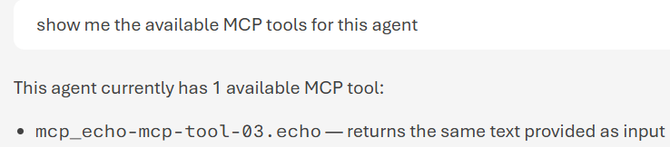
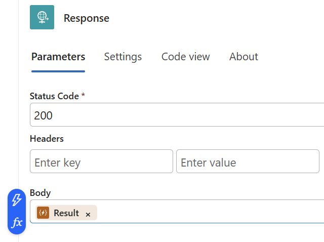
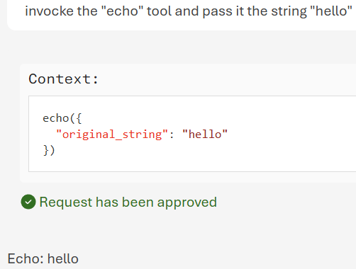

# Lab 2 — Add an MCP tool to your agent

> *Extend the agent with external tools through the Toolbox / Model Context Protocol.*

| | |
|---|---|
| **Audience** | CSA, developers, data scientists |
| **Duration** | 45–60 minutes |
| **Level** | Intermediate |
| **You will build** | An agent connected to a remote MCP server, invoking an external tool with approval control |
| **Plane** | BUILD — Foundry Agent Service (open standards) |

> [!NOTE]
> The instructor performs each step live; follow along on your own machine. Replace every `<angle-bracket placeholder>` with your own value.

---

## Prerequisites

- The agent from [Lab 1](./lab-01x01-create-a-prompt-agent.md) (or any prompt-based agent in your project).
- A reachable MCP server endpoint (a public sample MCP server like the ***Work IQ Word MCP*** Tool, an internal one, or a `Foundry Toolbox` exposed as an MCP endpoint). In this exercise we will create a brand (new MCP Tool in Python)[### 2.1 Create the MCP server]

- ***If*** the MCP server requires auth: permission to create a **project connection** to hold the credential.

## Learning objectives

- Understand **MCP** as the open standard for exposing tools to any LLM client.
- Add a remote MCP server as a tool and authenticate via a project connection.
- Control tool execution with an **approval policy**, and review/approve a tool call.
- Recognise the single **Toolbox** MCP endpoint the agent talks to.

---

## Step 1 — Understand what you are connecting

> [!NOTE]
> **Concept** — MCP (Model Context Protocol) is an open standard that lets a server expose tools and context to any MCP-compatible client — and Foundry Agent Service is such a client. This is what keeps your integrations vendor-neutral.

## Step 2 — Create the MCP tool in Python

In this step, we create a small MCP server, run it on your machine, and expose it through an anonymous HTTPS Dev Tunnel so that Foundry Agent Service can reach it.

### 2.1 Create the MCP server

In the `01-microsoft-ai-platform/labs` folder, create a file named `lab-2-echo_mcp_server.py` with the following content:

```python
from fastmcp import FastMCP

mcp = FastMCP("ASB Campaigns MCP")

@mcp.tool
def echo(original_string: str) -> str:
    """Returns the same text provided as input."""
    return f"Echo: {original_string}"

if __name__ == "__main__":
    mcp.run(
        transport="http",
        host="127.0.0.1",
        port=8000,
        json_response=True,
        stateless_http=True,
    )
```

The `@mcp.tool` decorator exposes the Python function as an MCP tool. The type hints and docstring become part of the tool schema that Foundry reads during tool discovery.

The server uses the Streamable HTTP transport and exposes its MCP endpoint at `http://127.0.0.1:8000/mcp`. The `json_response` and `stateless_http` options make the endpoint suitable for a managed remote client such as Foundry Agent Service.

### 2.2 Start the local server

Open a terminal in the `01-microsoft-ai-platform/labs` folder, activate the virtual environment, and run the server, either in debug mode or from the command line:

```bash
python lab-2-echo_mcp_server.py
```

Keep this execution running. FastMCP should report an address similar to:

```text
Starting MCP server 'ASB Campaigns MCP' with transport 'http' (stateless) on
http://127.0.0.1:8000/mcp
```

> [!IMPORTANT]
> Only one process can listen on port `8000`. If you receive `Address already in use`, stop the previous server instance with `Ctrl+C` before starting it again.

### 2.3 Expose port 8000 through Dev Tunnels

Open a **second terminal**. If you completed the permanent Dev Tunnel setup in [Environment Preparation](../../environment_preparation.md#7-configure-devtunnel), host the existing tunnel:

```bash
devtunnel host mylocalmcpserver --allow-anonymous
```

For a temporary tunnel instead, run:

```bash
devtunnel host -p 8000 --allow-anonymous
```

The temporary URL changes when the tunnel is recreated. A hosted tunnel reports URLs similar to:

```text
Hosting port: 8000
Connect via browser: https://<tunnel-id>-8000.<region>.devtunnels.ms
Ready to accept connections for tunnel: mylocalmcpserver.<region>
```

Keep this second terminal running as well. Build the public MCP endpoint by appending `/mcp` to the port-specific HTTPS URL:

```text
https://<tunnel-id>-8000.<region>.devtunnels.ms/mcp
```

For example:

```text
https://5ndxcpg3-8000.eun1.devtunnels.ms/mcp
```

Do not use the site root: `/` returns `404 Not Found` because FastMCP exposes the protocol endpoint specifically at `/mcp`.

### 2.4 Verify the public MCP endpoint

From another terminal, send an MCP `tools/list` request through the tunnel:

```bash
curl -sS -X POST "https://<tunnel-id>-8000.<region>.devtunnels.ms/mcp" \
  -H "Content-Type: application/json" \
  -H "Accept: application/json" \
  --data '{"jsonrpc":"2.0","id":1,"method":"tools/list","params":{}}'
```

The response should contain a tool named `echo`. You can also invoke it directly:

```bash
curl -sS -X POST "https://<tunnel-id>-8000.<region>.devtunnels.ms/mcp" \
  -H "Content-Type: application/json" \
  -H "Accept: application/json" \
  --data '{"jsonrpc":"2.0","id":2,"method":"tools/call","params":{"name":"echo","arguments":{"original_string":"Foundry test"}}}'
```

The result should include `Echo: Foundry test`.

> ✅ **Checkpoint** — The Python server and Dev Tunnel terminals are both running, and the public `/mcp` endpoint returns the `echo` tool.

## Step 3 — Add the MCP tool in the portal

- Open your agent → **Tools** → **Add a tool**, then choose:
  - **Model Context Protocol (MCP)**.
  - **Server label:** a short name, e.g. `echo-mcp-tool-01`.
  - **Server URL:** the public endpoint from Step 2, e.g. `https://<tunnel-id>-8000.<region>.devtunnels.ms/mcp`.
  - **Authentication:** none. The lab tunnel was started with `--allow-anonymous`.
  - Optionally scope which of the server's tools the agent may use (*allowed tools*).

## Step 4 — Authenticate via a project connection (if needed)

If the server is protected, attach a **project connection** that holds the credential (API key or OAuth). Configure it once here — never hard-code secrets in the agent or client code. Public sample servers can be added without a connection.

> [!WARNING]
> **Private endpoints** — If your MCP server is on a private network, ensure the project's networking (VNet / private endpoint) can reach it, otherwise the tool call will time out.

## Step 5 — Set the approval policy

Choose how tool calls are approved. For a first test set `require_approval: always` so you can see and approve each call; switch to `never` for trusted, unattended tools.

## Step 6 — Test the tool from the playground
Ask a generic MCP question, for example ***Show me the available MCP tools for this agent***. You should get an answer similar to the following one:<br/>
<br/>

Ask a question that forces the agent to use the MCP tool, for example ***invoke the "echo" tool and pass it the string "hello"***. You should get an approval request:<br/>
<br/>

After the request is approved, you should get the final answer:<br/>
<br/>

## Step 7 — The same tool from code (will be done in the third section  of this workshop)

The MCP tool can also be declared when you call the agent from code (see [Lab 3](./lab-01x03-call-via-responses-api.md). Representative shape of the tool declaration:

```python
tools = [{
    "type": "mcp",
    "server_label": "contoso-tools",
  "server_url": "https://<your-mcp-server>/mcp",
    "require_approval": "never"
}]
# pass tools=tools to the Responses API call (Lab 3)
```

---

## Try it yourself (extension)

- Connect a `Foundry Toolbox` as the MCP endpoint and expose several curated tools behind one URL.
- Restrict *allowed tools* to a subset and confirm the others are not callable.
- Flip approval from `always` to `never` and observe the difference in the run.

## Troubleshooting

| Symptom | Likely cause & fix |
|---------|--------------------|
| Tool never gets called | The question didn't require the tool, or the instruction didn't encourage tool use — ask something only the tool can answer. |
| 401 / 403 from the server | Missing or wrong project connection — re-check the credential in Step 3. |
| Call times out | Server or Dev Tunnel is not running, the endpoint is unreachable, or the URL is wrong — verify both terminals and ensure the endpoint ends in `/mcp`. |
| Stuck on approval | `require_approval` is set to `always` — approve the call, or set it to `never` for trusted tools. |

## What you learned

You extended the agent with an external capability over an open protocol, authenticated centrally through a connection, and controlled execution with approvals — all behind a single **Toolbox** MCP endpoint. In **Lab 3** you call this agent from your own code.

---

[← Lab 1](./lab-01x01-create-a-prompt-agent.md) · [Session index](../README.md) · **Next:** [Lab 3 — Call via the Responses API →](./lab-01x03-call-via-responses-api.md)
