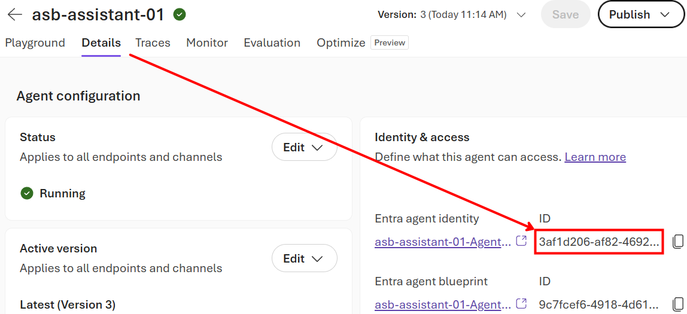
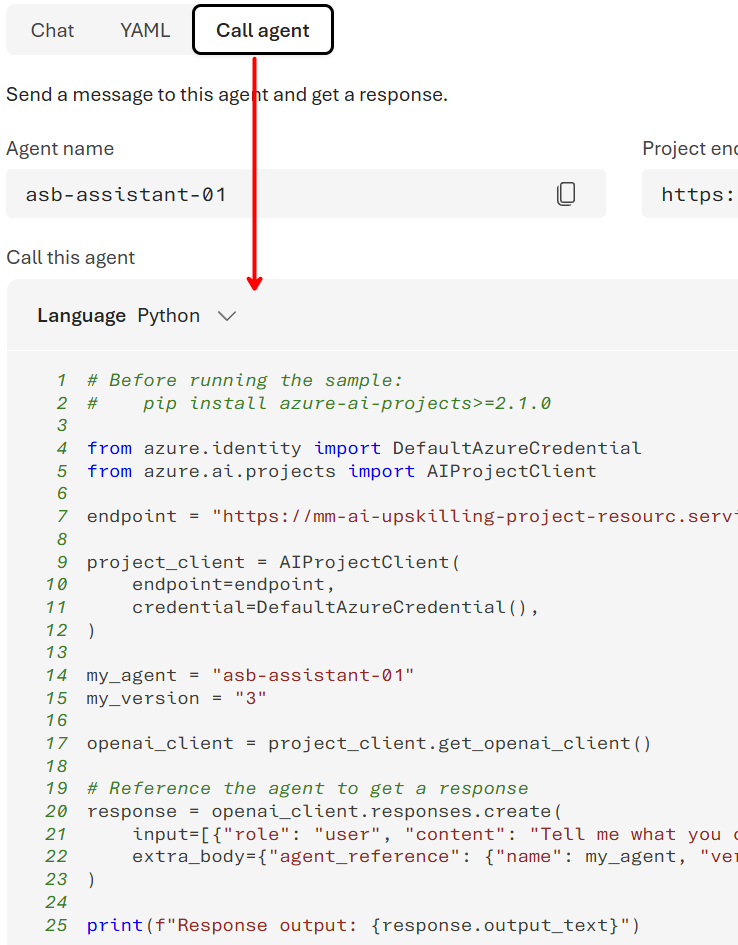

# Lab 3 — Call your agent via the Responses API

> *Use each agent's Coding panel to run it from your own application code.*

| | |
|---|---|
| **Audience** | developers, data scientists |
| **Duration** | 45–60 minutes |
| **Level** | Intermediate |
| **You will build** | A small script that invokes your agent through the Responses API and streams the result |
| **Plane** | BUILD — Foundry Agent Service (integration) |

> [!NOTE]
> The instructor performs each step live; follow along on your own machine. Replace every `<angle-bracket placeholder>` with your own value.

---

## Prerequisites

- The Project Responses Endpoint, for example `https://ai-upskilling-project-resourc.services.ai.azure.com/api/projects/ai-upskilling-project/agents/asb-assistant-01/endpoint/protocols/openai/responses`, that you may retrieve from here:


- The agent from [Lab 1](lab-01x01-create-a-prompt-agent.md)/[Lab 2](lab-01x02-add-an-mcp-tool.md) and its **agent ID**, for example `3af1d206-af82-4692-94e7-db7654435e6e` that you may retrieve from:<br/>

- A local Python Environment Python with the needed packages, or Python 3.10+ installed locally and the ability to install packages in a virtual environment: `pip install openai azure-identity` (or use the shared [environment setup](../../environment_preparation.md)).
- Authentication: **Microsoft Entra ID** (recommended) via `az login`, or an API key.

## Learning objectives

- Find and use the per-agent **Coding** (*View code*) panel in Foundry.
- Authenticate to the Responses API with Entra ID (a bearer token) rather than a key.
- Send a request, read the response, and **stream** tokens.
- Continue a multi-turn conversation with server-side state.

---

## Step 1 — Open the Coding panel

Open your agent in the portal and select the **Call agent** panel. Foundry generates a ready-to-run snippet for your exact resource: it contains the correct endpoint, API version (**v1**) and model/agent reference. Choose the **Python** language>



> [!IMPORTANT]
> **Copy from the portal** — Always prefer the snippet the Coding panel gives you; it is pre-filled with your endpoint and version. The code below is the representative shape so you understand each part.

## Step 2 — Set up your environment (or Activate it, if you already have one)

```bash
python -m venv .venv && source .venv/bin/activate   # Windows: .venv\Scripts\activate
pip install openai azure-identity
az login   # signs you in for Entra ID auth
```

## Step 3 — Call the agent (Entra ID auth)

Representative Python using a bearer token from Entra ID. Replace the endpoint/model with the values from your Coding panel in the file [`lab-01x03-call-via-responses-api_oneshot`](./lab-01x03-call-via-responses-api_oneshot.py):

```python
# Before running the sample:
#    pip install azure-ai-projects>=2.1.0

from azure.identity import DefaultAzureCredential
from azure.ai.projects import AIProjectClient

endpoint = "https://ai-upskilling-project-resourc.services.ai.azure.com/api/projects/ai-upskilling-project"

project_client = AIProjectClient(
    endpoint=endpoint,
    credential=DefaultAzureCredential(),
)

my_agent = "asb-assistant-01"
my_version = "3"

openai_client = project_client.get_openai_client()

# Reference the agent to get a response
response = openai_client.responses.create(
    input=[{"role": "user", "content": "Tell me what you can help with."}],
    extra_body={"agent_reference": {"name": my_agent, "version": my_version, "type": "agent_reference"}},
)

print(f"Response output: {response.output_text}")
```

> ✅ **Checkpoint** — You get a one-sentence Italian reply printed to your terminal. If so, your app is now talking to the agent.

## Step 4 — Stream the response

For a responsive UX, stream tokens as they are generated. You may simply adapt the existing file [`lab-01x03-call-via-responses-api_streaming`](./lab-01x03-call-via-responses-api_streaming.py):

```python
# Before running the sample:
#    pip install azure-ai-projects>=2.1.0

from azure.identity import DefaultAzureCredential
from azure.ai.projects import AIProjectClient

endpoint = "https://mm-ai-upskilling-project-resourc.services.ai.azure.com/api/projects/ai-upskilling-project"

project_client = AIProjectClient(
    endpoint=endpoint,
    credential=DefaultAzureCredential(),
)

my_agent = "asb-assistant-01"
my_version = "3"

openai_client = project_client.get_openai_client()

# Reference the agent and stream its response
stream = openai_client.responses.create(
    input=[{"role": "user", "content": "Tell me what you can help with."}],
    extra_body={"agent_reference": {"name": my_agent, "version": my_version, "type": "agent_reference"}},
    stream=True,
)

for event in stream:
    if event.type == "response.output_text.delta":
        print(event.delta, end="", flush=True)
```

## Step 5 — Continue the conversation (server-side state)

The Responses API is stateful. Pass the previous response id to continue a thread without resending history:

```python
# Reference the agent to get a response
response = openai_client.responses.create(
    input=[{"role": "user", "content": "Tell me what you can help with."}],
    extra_body={"agent_reference": {"name": my_agent, "version": my_version, "type": "agent_reference"}},
)

print(f"Response output: {response.output_text}")

# Reference the agent to get a follow-up response, using the previous response's ID
follow_up = openai_client.responses.create(
    input=[{"role": "user", "content": "Tell me more about the last features you mentioned."}],
    extra_body={"agent_reference": {"name": my_agent, "version": my_version, "type": "agent_reference"}},
    previous_response_id=response.id
)

print(f"Follow-up response output: {follow_up.output_text}")
```

## Step 6 — REST equivalent (optional)

The same call over REST, for non-Python stacks.
In both cases, the invoker must have at least the "Foundry Agent Consumer" role assigned to the Foundry Agent or Project as explained [here](https://learn.microsoft.com/en-us/azure/foundry/concepts/rbac-foundry?tabs=owner%2Cfoundry#built-in-roles)


```bash
@foundry_project_endpoint = https://ai-upskilling-project-resourc.services.ai.azure.com/api/projects/ai-upskilling-project

@agent_name = asb-assistant-01 

@query = What can you do?

###
# Invoking Foundry Agent within a Foundry Project with RESPONSES APIs
# We can use either the user token or the app token for Foundry (bearertoken_user-token_for_foundry or bearertoken_app-token_for_foundry).
POST {{foundry_project_endpoint}}/agents/{{agent_name}}/endpoint/protocols/openai/responses?api-version={{azure_openai_responses_api_version}}
Authorization: Bearer {{bearertoken_user-token_for_foundry}}
Content-Type: application/json

{
    "input": "{{query}}"
}
```

---

## Try it yourself (extension)

- Add the MCP tool from [Lab 2](./lab-01x02-add-an-mcp-tool.md) to the call via the `tools` parameter and watch a tool-augmented response.
- Wrap the streaming call in a tiny CLI loop to chat with the agent from your terminal.
- Switch auth from Entra ID to an API key and note when each is appropriate.

## Troubleshooting

| Symptom | Likely cause & fix |
|---------|--------------------|
| 401 Unauthorized | Token/scope wrong — run `az login`, and confirm the resource/scope matches your Coding-panel snippet. |
| 404 / model not found | Wrong model or agent reference — copy the exact value from the Coding panel. |
| Endpoint/region error | The resource region may not support the Responses API v1 — check the panel's endpoint and version. |
| No streamed output | Your SDK version differs — use the streaming shape from your generated snippet; event fields can vary by version. |

## What you learned

You took the agent out of the portal and into code via the Responses API, using the per-agent **Coding** panel, with Entra ID auth, streaming and stateful conversation. In **Lab 4** you publish it and invoke it with its own identity — without OBO.

---

[← Lab 2](./lab-01x02-add-an-mcp-tool.md) · [Session index](../README.md) · **Next:** [Lab 4 — Publish to Agent 365 (without OBO)](./lab-01x04-publish-to-agent365-no-obo.md)
