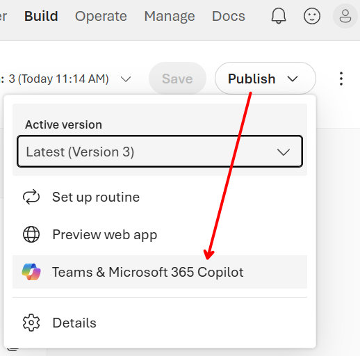
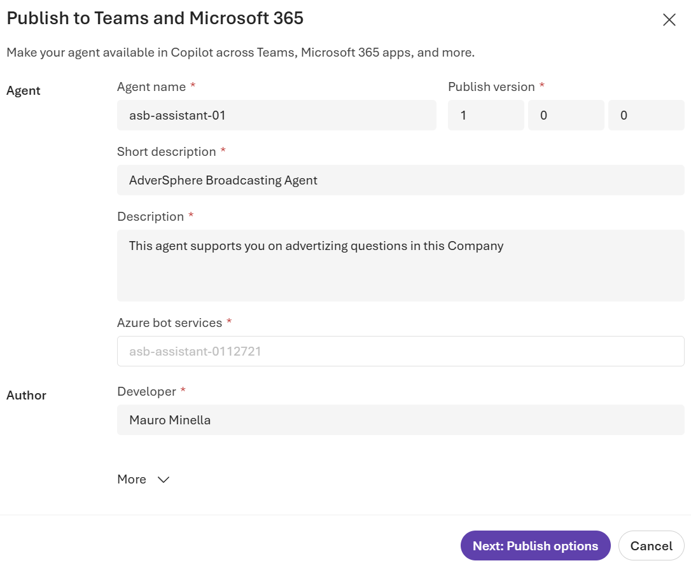
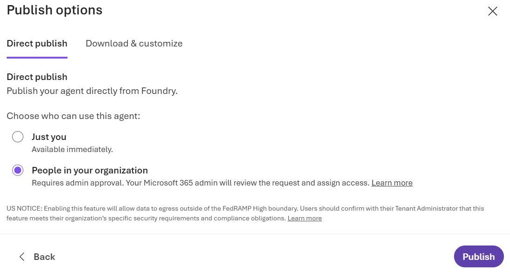
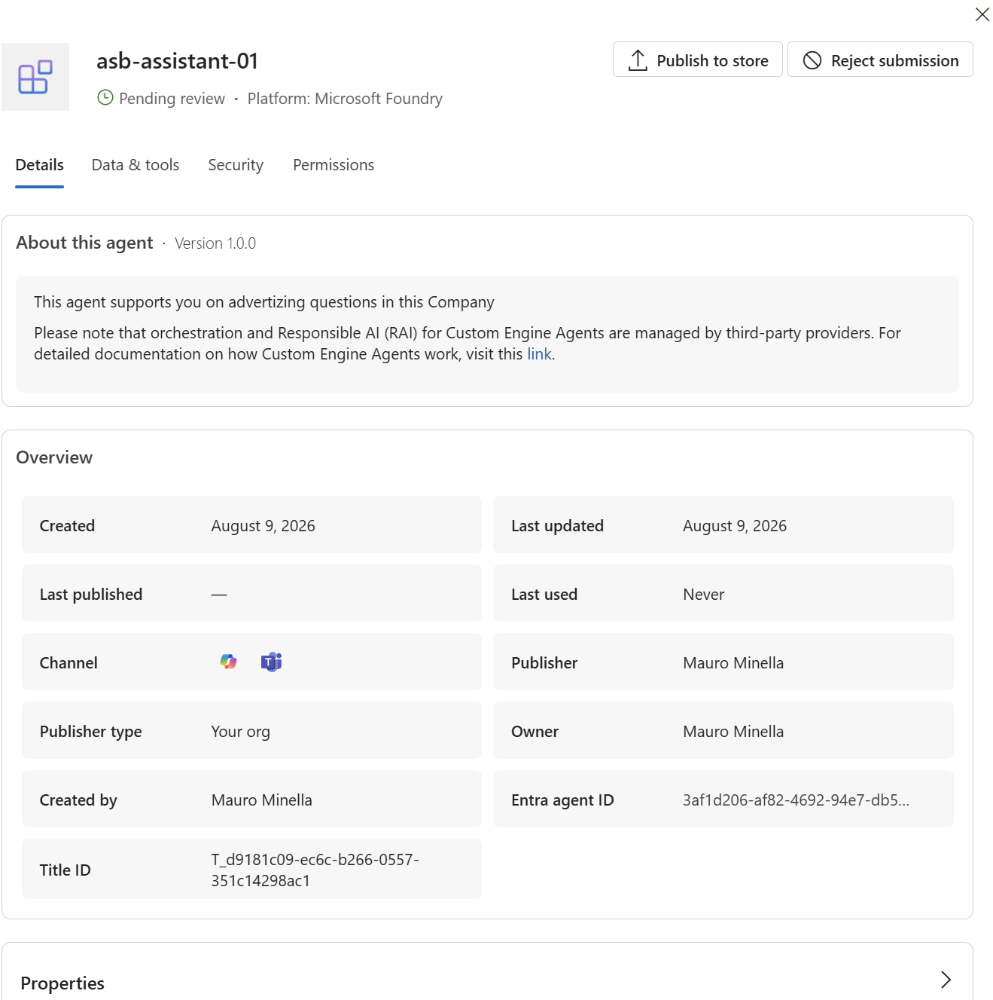
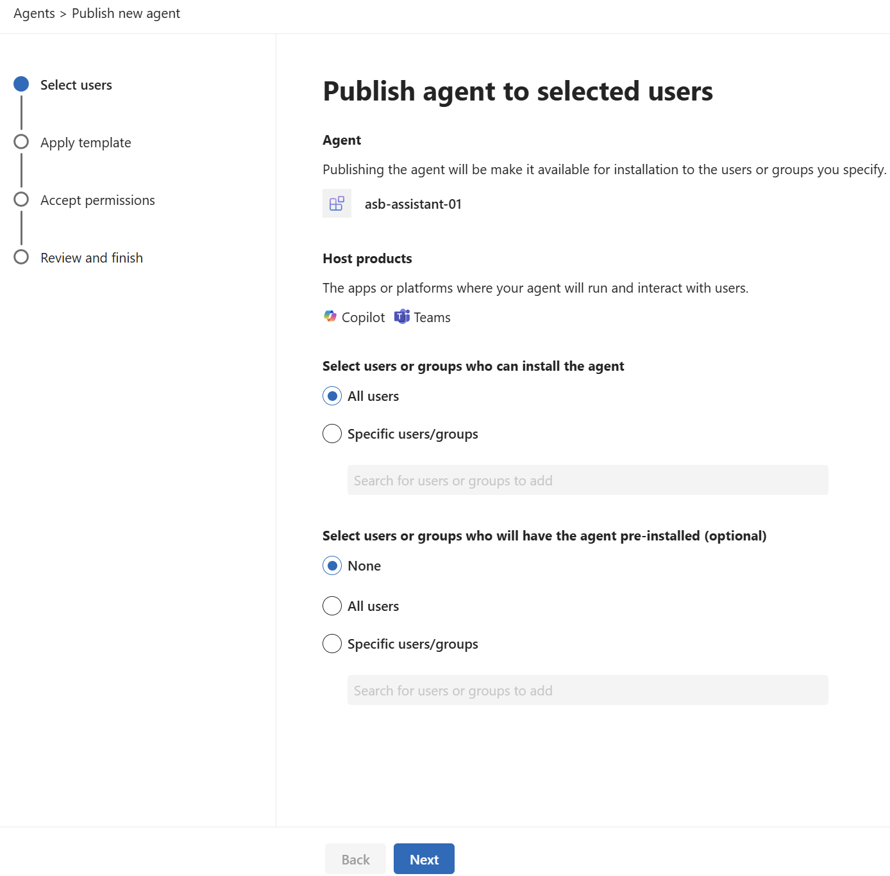
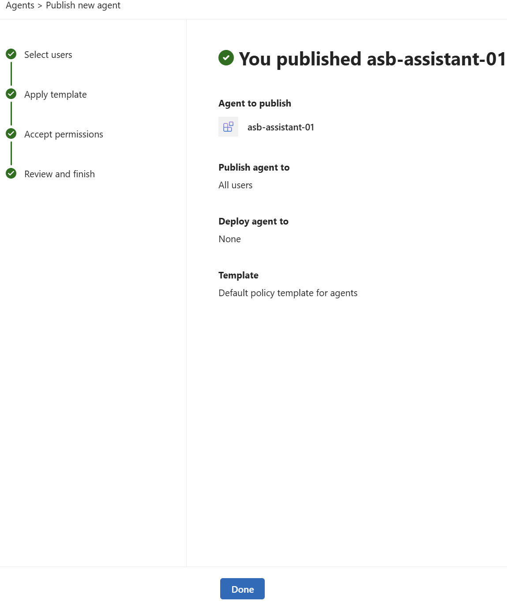
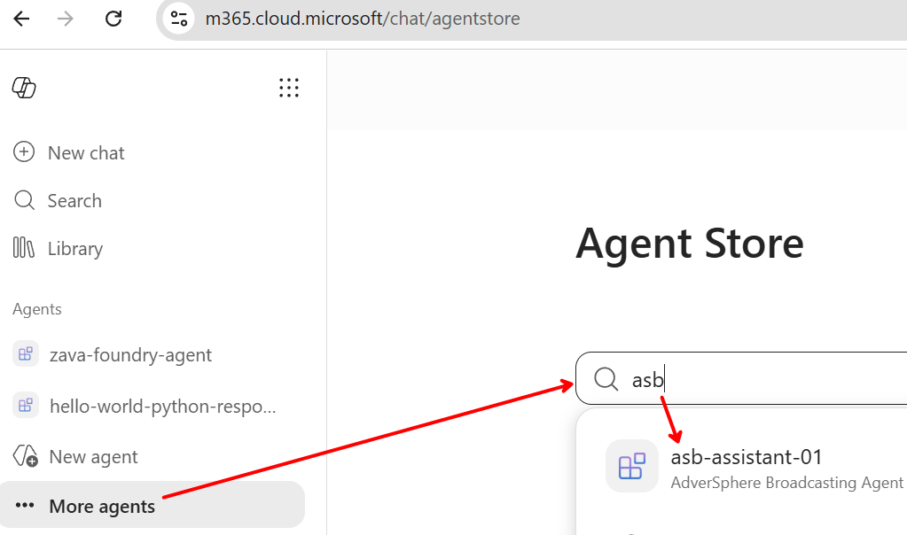
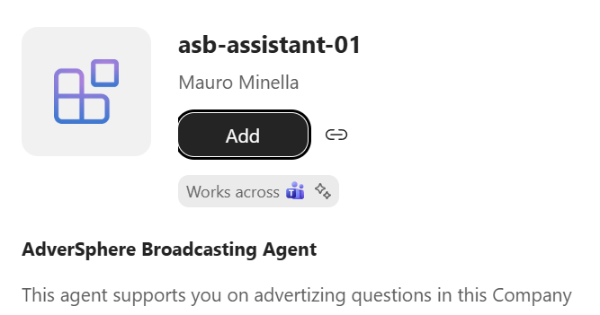
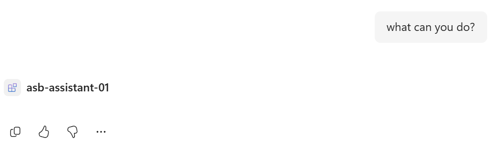

# Lab 4 - Publish a Foundry agent to Agent 365

> Make a Foundry agent available in Microsoft 365 Copilot and Teams, approve it in the Agent 365 admin experience, and test it as an end user.

| | |
|---|---|
| **Audience** | Developers, agent owners, and Microsoft 365 administrators |
| **Duration** | 20-25 minutes, plus any tenant propagation time |
| **Level** | Intermediate |
| **You will publish** | The prompt-based agent created in the previous labs |
| **Surfaces** | Microsoft Foundry, Agent 365, Microsoft 365 Copilot, and Teams |

> [!NOTE]
> This lab has two personas. The **agent owner** completes the Foundry steps, while a **Microsoft 365 administrator** reviews the request and assigns access. In a classroom, the instructor or tenant administrator may need to complete the admin steps for students.

## Prerequisites

- A working Foundry agent from [Lab 1](./lab-01x01-create-a-prompt-agent.md), optionally extended with the MCP tool from [Lab 2](./lab-01x02-add-an-mcp-tool.md).
- Permission to publish the agent from its Foundry project.
- A Microsoft 365 tenant enabled for Agent 365 and Microsoft 365 Copilot.
- A Microsoft 365 administrator who can review agent requests and publish agents to users or groups.
- A licensed test user who can open Microsoft 365 Copilot.
- The agent must use resources that are reachable after publication. A local MCP server or a temporary development tunnel must remain available while testing.

## Learning objectives

- Publish a specific Foundry agent version to Teams and Microsoft 365 Copilot.
- Understand the difference between submitting an agent and making it available to users.
- Review the agent's details, tools, security, and permissions before approval.
- Assign the agent to all users or selected users and groups.
- Find, add, and use the published agent in Microsoft 365 Copilot.

## Step 1 - Test and save the agent version

Open the agent in Microsoft Foundry and test the prompts and tools that students configured in the previous labs. Resolve any errors before publishing.

Select **Save** if the current changes have not been saved. From the **Publish** menu, confirm the active version that you want to release, and then select **Teams & Microsoft 365 Copilot**.



> [!IMPORTANT]
> Publishing creates a release from the selected saved version. Later edits to the agent are not included until you save and publish a new version.

## Step 2 - Enter the publishing details

Complete the **Publish to Teams and Microsoft 365** form:

- **Agent name**: use a recognizable name, such as `asb-assistant-01`.
- **Publish version**: use the proposed semantic version, or increment it when republishing.
- **Short description**: summarize the agent in one sentence.
- **Description**: explain what the agent does and who should use it.
- **Azure bot services**: review the generated name. It must be unique where required.
- **Developer**: confirm the displayed publisher or author name.

Expand **More** if you need to review optional branding or metadata. Do not include secrets, internal endpoints, or credentials in descriptions. Select **Next: Publish options**.



## Step 3 - Submit the agent for your organization

On **Publish options**, keep **Direct publish** selected. Choose **People in your organization** so the agent can be reviewed and assigned through Agent 365, and then select **Publish**.



This option submits a request; it does not immediately make the agent available to everyone. The request must be reviewed by a Microsoft 365 administrator.

> [!TIP]
> **Just you** is useful for an owner-only test and is available immediately. Use **People in your organization** for the governed classroom flow in this lab.

> [!NOTE]
> If Foundry displays a data-boundary or compliance notice, stop and confirm that publishing is permitted by your organization before continuing.

## Step 4 - Review the request in Agent 365

Switch to the Microsoft 365 administrator persona and open the [requested agents page in the Microsoft 365 admin center](https://admin.cloud.microsoft/?#/agents/all/requested).

Find the submitted agent and open it. Its status should be **Pending review**, and its platform should be **Microsoft Foundry**. Before approval, review the available tabs:

- **Details**: description, version, publisher, owner, channels, and Entra agent ID.
- **Data & tools**: data sources and tools the agent can access.
- **Security**: security and risk information available for the agent.
- **Permissions**: permissions requested by the agent.

Select **Publish to store** only after the review is complete. If the request is unexpected, unsafe, or incorrectly configured, select **Reject submission** instead.



> [!IMPORTANT]
> Approval is a governance decision, not just a deployment step. Verify the agent's tools, data access, owner, permissions, and intended audience before publishing it.

## Step 5 - Select the audience and deployment behavior

In the **Publish agent to selected users** wizard, configure who may install the agent:

- Select **All users** for a controlled training tenant, or **Specific users/groups** for a limited pilot.
- Under the optional pre-installation section, select **None** to let eligible users add the agent themselves.
- Choose a pre-installation option only when your organization intends to deploy the agent automatically.

Select **Next**.



Complete the remaining wizard pages:

1. Review or apply the organization's policy template.
2. Review and accept the permissions required by the agent.
3. Confirm the selected audience and deployment behavior.
4. Finish the publishing operation.

The confirmation page should show the selected audience and the applied policy template. Select **Done**.



> [!NOTE]
> Availability is not always immediate. Tenant policy and service propagation can delay discovery in Copilot or Teams. If the agent does not appear, wait a few minutes and try again before troubleshooting.

## Step 6 - Discover the agent in Microsoft 365 Copilot

Sign in as a user included in the audience selected by the administrator, and open [Microsoft 365 Copilot](https://m365.cloud.microsoft/chat/).

Open **More agents** to enter the Agent Store. Search for the published agent by its exact name.



Open the result and verify the agent name, publisher, description, and supported host products. Select **Add**.



The agent should now appear in the **Agents** section of the Copilot navigation.

## Step 7 - Test the published agent

Open the agent and send a simple prompt, for example:

```text
What can you do?
```

Then test one of the scenarios from the earlier labs. If the agent uses an MCP tool, send a prompt that should invoke that tool and confirm that the external service is still reachable.



> [!NOTE]
> The published agent may answer in the language specified by its Foundry instructions even when the test prompt uses another language.

## Checkpoint

You have completed the lab when:

- Foundry shows that the selected agent version was submitted successfully.
- The administrator has reviewed and published the agent for the intended audience.
- An eligible user can find and add the agent from the Agent Store.
- The agent responds in Microsoft 365 Copilot and any required tools execute successfully.

## Troubleshooting

### The request does not appear in the admin center

- Confirm that **People in your organization** was selected during publishing.
- Confirm that Foundry and the Microsoft 365 admin center use the same tenant.
- Refresh the requested agents page after allowing time for propagation.
- Verify that the signed-in administrator has permission to review and publish agents.

### The agent is published but users cannot find it

- Confirm that the user or one of their groups is included in the assigned audience.
- Confirm that the publishing wizard completed successfully.
- Sign out and back in, or refresh Microsoft 365 Copilot after propagation.
- Check whether tenant policies restrict custom agents or the Agent Store.

### The agent opens but a tool fails

- Test the same tool from the Foundry playground.
- Confirm that remote endpoints, credentials, and connections are still valid.
- If the agent uses the local MCP server from Lab 2, keep both the server and its development tunnel running.
- Publish a new agent version after correcting its configuration.