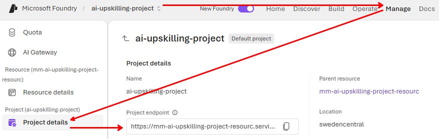
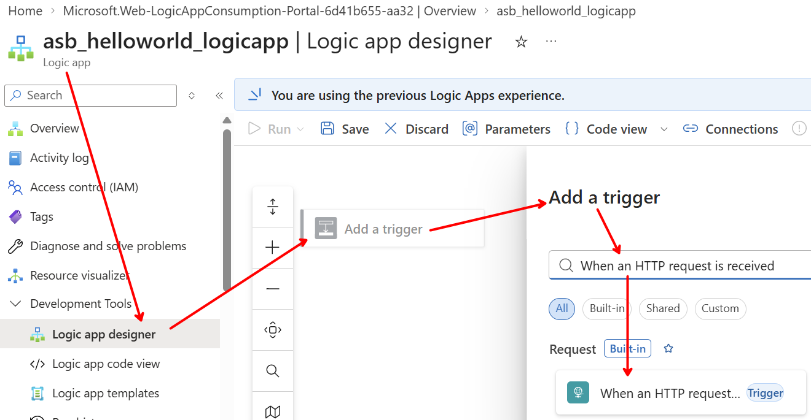
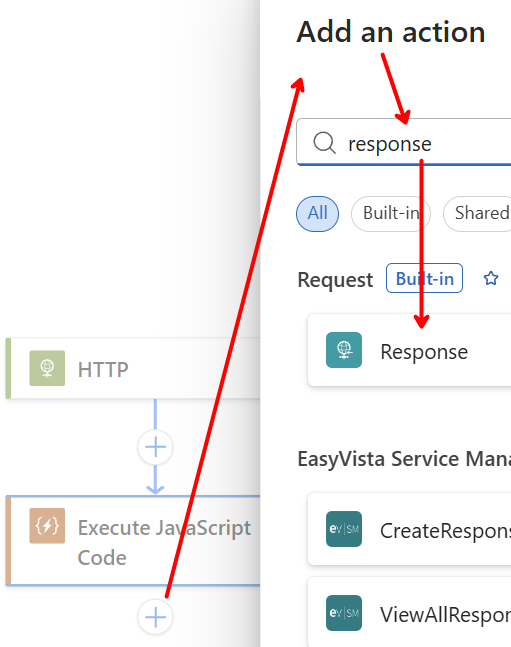

# Lab 2 — Add an MCP tool to your agent

> *Extend the agent with external tools through the Toolbox / Model Context Protocol.*

| | |
|---|---|
| **Audience** | CSA, developers, data scientists |
| **Duration** | 45–60 minutes |
| **Level** | Intermediate |
| **You will build** | An agent connected to a remote MCP server, invoking an external tool with approval control |
| **Plane** | BUILD — Foundry Agent Service (open standards) |

> [!NOTE]
> The instructor performs each step live; follow along on your own machine. Replace every `<angle-bracket placeholder>` with your own value.

---

## Prerequisites

- The agent from [Lab 1](lab-1-create-a-prompt-agent.md) (or any prompt-based agent in your project).
- A reachable MCP server endpoint (a public sample MCP server like the ***Work IQ Word MCP*** Tool, an internal one, or a `Foundry Toolbox` exposed as an MCP endpoint). For practical reasons, in this exercise we will leverage the ***Work IQ Word*** (not MCP) tool, that would require the creation of an Azure Logic App.
---
### `Work IQ Word` or `Work IQ Word MCP`?
- **Work IQ Word** is a native Agent Service tool. It is not a true MCP server, but an internal capability already hosted by Microsoft.
- **Work IQ Word MCP**, by contrast, is an external MCP tool template. You must host it yourself using a Logic App, Azure Function, container, or another runtime because it is not a native Agent Service tool.
### Why do both exist? They serve different purposes:
- **Work IQ Word (native)** is best suited to prototypes. It requires no infrastructure and provides standard Word functionality, such as creating documents and adding text, tables, and images.
- **Work IQ Word MCP (self-hosted)** is intended for enterprise scenarios that require deep customization, integration with internal systems, custom logic, or company-specific compliance controls. You can modify the MCP server code and add Word operations that the native tool does not provide.
---
- ***If*** the MCP server requires auth: permission to create a **project connection** to hold the credential.

## Learning objectives

- Understand **MCP** as the open standard for exposing tools to any LLM client.
- Add a remote MCP server as a tool and authenticate via a project connection.
- Control tool execution with an **approval policy**, and review/approve a tool call.
- Recognise the single **Toolbox** MCP endpoint the agent talks to.

---

## Step 1 — Understand what you are connecting

> [!NOTE]
> **Concept** — MCP (Model Context Protocol) is an open standard that lets a server expose tools and context to any MCP-compatible client — and Foundry Agent Service is such a client. This is what keeps your integrations vendor-neutral.

## Step 2 — Create the MCP tool via a new Azure Logic App
### 2.1 Choose **Multitenant** consumption plan

### 2.2 Name it *asb_helloworld_logicapp*
### 2.3 Go to **Logic App Designer** and create an hhtp trigger

### 2.4 Add a *Javascript Code* action 

, and enter the following Javascript code:
```javascript
// MCP server minimale dentro Logic App
// Tool: echo

function handleMcpRequest(body) {
    if (!body || !body.method) {
        return {
            jsonrpc: "2.0",
            error: { code: -32600, message: "Invalid MCP request" }
        };
    }

    // Tool invocation
    if (body.method === "tools/echo") {
        const text = body.params?.text || "";
        return {
            jsonrpc: "2.0",
            result: { text }
        };
    }

    // Manifest request
    if (body.method === "manifest/get") {
        return {
            jsonrpc: "2.0",
            result: {
                name: "logicapp-echo-mcp",
                version: "1.0.0",
                tools: [
                    {
                        name: "echo",
                        description: "Returns the same text provided as input",
                        inputSchema: {
                            type: "object",
                            properties: { text: { type: "string" } },
                            required: ["text"]
                        },
                        outputSchema: {
                            type: "object",
                            properties: { text: { type: "string" } }
                        }
                    }
                ]
            }
        };
    }

    return {
        jsonrpc: "2.0",
        error: { code: -32601, message: "Unknown MCP method" }
    };
}

return handleMcpRequest(context.request.body);
```
### 2.5 Add a Response as the final action

, where we return the JavaScript Code as JSON body:


### 2.6 Save the App and note the 
## Step 2 — Add the MCP tool in the portal

- Open your agent → **Tools** → **Add a tool** 
- For the purpose of this exercise, please choose → **Catalog** → **Work IQ Word**.
- More in general, to add a full MCP Server, please choose:   
  - → **Model Context Protocol (MCP)**.
  - **Server label:** a short name, e.g. `asb-tools`.
  - **Server URL:** your MCP endpoint, e.g. `https://<your-mcp-server>/sse`.
  - Optionally scope which of the server's tools the agent may use (*allowed tools*).

## Step 3 — Authenticate via a project connection (if needed)

If the server is protected, attach a **project connection** that holds the credential (API key or OAuth). Configure it once here — never hard-code secrets in the agent or client code. Public sample servers can be added without a connection.

> [!WARNING]
> **Private endpoints** — If your MCP server is on a private network, ensure the project's networking (VNet / private endpoint) can reach it, otherwise the tool call will time out.

## Step 4 — Set the approval policy

Choose how tool calls are approved. For a first test set `require_approval: always` so you can see and approve each call; switch to `never` for trusted, unattended tools.

## Step 5 — Test the tool from the playground

Ask a question that forces the agent to use the MCP tool, for example "Produce e quite extensive presentation of yourself and save it into a professional Word document". In the run detail you will see: the model deciding to call the tool → (if approval is on) an approval prompt → the tool result returning → the final answer grounded in that result.

> ✅ **Checkpoint** — You can see a tool invocation to your MCP server and a result flowing back into the answer. The agent used the tool rather than guessing.

## Step 6 — The same tool from code (will be done in the third section  of this workshop)

The MCP tool can also be declared when you call the agent from code (see [Lab 3](lab-3-call-via-responses-api.md)). Representative shape of the tool declaration:

```python
tools = [{
    "type": "mcp",
    "server_label": "contoso-tools",
    "server_url": "https://<your-mcp-server>/sse",
    "require_approval": "never"
}]
# pass tools=tools to the Responses API call (Lab 3)
```

---

## Try it yourself (extension)

- Connect a `Foundry Toolbox` as the MCP endpoint and expose several curated tools behind one URL.
- Restrict *allowed tools* to a subset and confirm the others are not callable.
- Flip approval from `always` to `never` and observe the difference in the run.

## Troubleshooting

| Symptom | Likely cause & fix |
|---------|--------------------|
| Tool never gets called | The question didn't require the tool, or the instruction didn't encourage tool use — ask something only the tool can answer. |
| 401 / 403 from the server | Missing or wrong project connection — re-check the credential in Step 3. |
| Call times out | Server unreachable (private network) or wrong URL — verify connectivity and the endpoint path (often ends in `/sse`). |
| Stuck on approval | `require_approval` is set to `always` — approve the call, or set it to `never` for trusted tools. |

## What you learned

You extended the agent with an external capability over an open protocol, authenticated centrally through a connection, and controlled execution with approvals — all behind a single **Toolbox** MCP endpoint. In **Lab 3** you call this agent from your own code.

---

[← Lab 1](lab-1-create-a-prompt-agent.md) · [Session index](../README.md) · **Next:** [Lab 3 — Call via the Responses API →](lab-3-call-via-responses-api.md)
