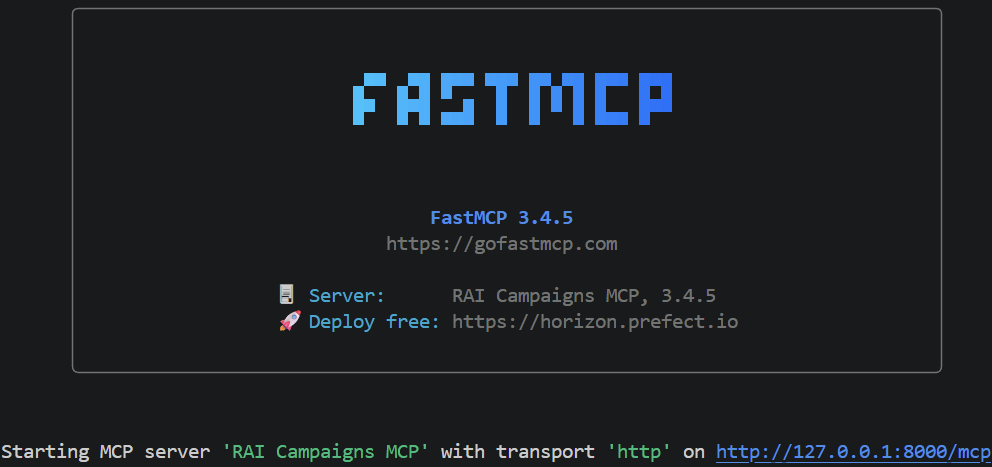

# Exercise 3 - Expose the campaigns as an MCP server
### Topic: Model Context Protocol (MCP) - Core duration: ~70 min

> **Goal:** build an **MCP server** that exposes AdvertSphere Broadcasting campaign data as **tools**,
> **resources** and **prompts**, then consume it with an **MCP client**. You'll see the
> "**build once, reuse everywhere**" principle in practice: the same server can later be used
> by any compliant agent (Agent Framework, Foundry, ...).

**Concepts you'll cement (Day 1 slides):** MCP's client-server architecture, the *primitives*
(tools / resources / prompts), the M x N -> M + N problem, tool reusability.

**Docs:** MCP <https://modelcontextprotocol.io/> - FastMCP <https://gofastmcp.com/>

> This exercise is **fully local**: no cloud credentials are needed for parts A-C.

---

## Prerequisites
- Packages from `requirements.txt` (`fastmcp`, `mcp`).
- The `asb_campaigns.py` file in the same folder.
- Two terminals (one for the server, one for the client).

---

## Part A - Build the MCP server (~30 min)

Create `mcp_server.py`. With **FastMCP** you define tools as plain functions: the *type hints*
and *docstrings* automatically generate the MCP schema.

```python
from fastmcp import FastMCP
from asb_campaigns import CAMPAIGNS, get_campaign, list_campaigns, roi

mcp = FastMCP("ASB Campaigns MCP")

# --- TOOLS: actions an agent can call ---
@mcp.tool
def get_campaign_details(campaign_id: str) -> dict:
    """Full details of a campaign by its id (e.g. 'CMP-004')."""
    c = get_campaign(campaign_id)
    return c or {"error": f"campaign {campaign_id} not found"}

@mcp.tool
def all_campaigns() -> list:
    """Short list (id, client, sector) of all campaigns."""
    return list_campaigns()

@mcp.tool
def top_campaigns_by_roi(n: int = 3) -> list:
    """Top n campaigns by descending ROI, with the ROI% value."""
    data = [{"id": c["id"], "client": c["client"], "roi_pct": roi(c["id"])}
            for c in CAMPAIGNS]
    data.sort(key=lambda x: x["roi_pct"], reverse=True)
    return data[:n]

# --- RESOURCE: readable data to ground the answers on ---
@mcp.resource("campaigns://all")
def campaigns_resource() -> list:
    """All campaigns as raw data (context for the agent)."""
    return CAMPAIGNS

# --- PROMPT: reusable template ---
@mcp.prompt
def evaluate_campaign(campaign_id: str) -> str:
    """Template to evaluate a campaign in a standard way."""
    return (
        f"Evaluate campaign {campaign_id}: fetch the data with the tools, "
        f"compute the ROI, compare it with the others and propose an action."
    )

if __name__ == "__main__":
    # HTTP transport: the server listens on http://127.0.0.1:8000/mcp
    mcp.run(transport="http", host="127.0.0.1", port=8000)
```

Start the server (**first terminal**):

```bash
python mcp_server.py
```

**What you should see:** a log saying the MCP server is listening on `127.0.0.1:8000`:

Leave it running.

---

## Part B - Consume the server with an MCP client (~25 min)

Create `mcp_client.py`. The client **discovers** the tools and then **calls** one - all over
the protocol, without knowing anything about the server's internal implementation.

```python
import asyncio
from fastmcp import Client

async def main():
    async with Client("http://127.0.0.1:8000/mcp") as client:
        # 1. discovery: which tools does the server expose?
        tools = await client.list_tools()
        print("Exposed tools:", [t.name for t in tools])

        # 2. call a tool
        res = await client.call_tool("top_campaigns_by_roi", {"n": 3})
        print("Top 3 by ROI:", getattr(res, "data", None) or res.content)

        # 3. read a resource
        resources = await client.read_resource("campaigns://all")
        print("Campaigns in the resource:", len(resources))

asyncio.run(main())
```

Run (**second terminal**):

```bash
python mcp_client.py
```

**What you should see:** the list of tools (`get_campaign_details`, `all_campaigns`,
`top_campaigns_by_roi`) and, at the top of the top-3 by ROI, **CMP-004 (VoloBlu, 134.0%)**.

> Note: depending on the FastMCP version, a `call_tool` result is read via `res.data`
> (structured output) or `res.content`. The snippet above tries both.

---

## Part C - Add a prompt and verify (~15 min)

You already defined the `evaluate_campaign` prompt. List it and fetch it from the client:

```python
# 4. get a prompt and render it
async with Client("http://127.0.0.1:8000/mcp") as client:
    prompts = await client.list_prompts()
    print("Available prompts:", [p.name for p in prompts])
    rendered = await client.get_prompt("evaluate_campaign", {"campaign_id": "CMP-005"})
    print(rendered.messages[0].content.text)
```

**What you should see:** the `evaluate_campaign` prompt and the text rendered for **CMP-005**.
Prompts capture "the right way to ask for something", reusable by anyone.

> Checkpoint: you have an MCP server exposing tools, resources and prompts over campaign data,
> and a client that consumes them. This is exactly what an agent would do on your behalf.

---

## Optional (bonus, ~15 min)

**B1 - Proper logging for MCP.** In an MCP server do **not** `print` to stdout (it would break
the JSON-RPC messages in stdio mode): use the `logging` module, which writes to *stderr*.
**IMPORTANT NOTE**: when we call logger.info within a server tool, then the stderr is the **SERVER** stderr, so if you are also debugging the client, you must switch to the server debug window.

```python
import logging
logger = logging.getLogger(__name__)
# inside a tool:  logger.info("Top ROI requested, n=%s", n)
```

**B2 - A new comparison tool.** Add to the server:
```python
from asb_campaigns import roi
@mcp.tool
def compare_campaigns(id_a: str, id_b: str) -> dict:
    """Compare the ROI of two campaigns and say which performs better."""
    logger.info("Evaluate campaign prompt requested for %s", campaign_id)
    ra, rb = roi(id_a), roi(id_b)
    better = id_a if (ra or -1e9) >= (rb or -1e9) else id_b
    return {"roi": {id_a: ra, id_b: rb}, "better": better}
```
Restart the server and call the tool from the client with `CMP-004` and `CMP-005`, for example:
```python
# 5. call the compare_campaigns tool
comparison = await client.call_tool("compare_campaigns", {"id_a": "CMP-005", "id_b": "CMP-004"})
print("Comparison of CMP-005 and CMP-004:", getattr(comparison, "data", None) or comparison.content)
```

**B3 - [Advanced] Let a model pick the tools.** Connect the local MCP server to an Agent
Framework agent so the model decides which campaign tool to call.

Keep `exercise-3-mcp_server.py` running in the first terminal. In the client, import
`MCPStreamableHTTPTool` and add this function:

```python
async def client_side_llm(query: str):
    import os
    from azure.identity import AzureCliCredential
    from agent_framework import Agent, MCPStreamableHTTPTool
    from agent_framework.openai import OpenAIChatClient
    from dotenv import load_dotenv

    load_dotenv()

    client = OpenAIChatClient(
        model=os.environ["AZURE_OPENAI_CHAT_DEPLOYMENT_NAME"],
        credential=AzureCliCredential(),
    )

    mcp_tool = MCPStreamableHTTPTool(
        name="asb_campaigns",
        url="http://127.0.0.1:8000/mcp",
        approval_mode="never_require",
        load_prompts=False,
    )

    agent = Agent(
        client=client,
        name="CampaignAnalyst",
        instructions="Always answer in English, concisely and professionally.",
        tools=[mcp_tool],
    )

    async with agent:
        answer = await agent.run(query)
    return answer.text
```

Call it from `main`, after the direct FastMCP client context has closed:

```python
llm_answer = await client_side_llm(
    "Which campaign is better and why, CMP-004 or CMP-005?"
)
print(f"LLM answer: {llm_answer}")
```

`MCPStreamableHTTPTool` is the important part of this example. Agent Framework connects to
`127.0.0.1` from the local Python process, discovers the MCP tools, sends their schemas to the
model and executes locally whichever tool the model selects. The model can still run in Azure;
only the MCP connection and tool execution are local.

The following options are intentional:

- `load_prompts=False` exposes only MCP tools to the agent. With Agent Framework 1.13.0,
  loading the `evaluate_campaign` prompt as a function can produce an invalid schema when an
  MCP prompt argument has no description.
- `async with agent` closes the MCP HTTP session and its asynchronous task group cleanly.
  Omitting it can produce an error while the program is shutting down.

### Invoke the local MCP server through Foundry Responses

To let Foundry Responses invoke the MCP server running locally, first create an HTTPS tunnel to `http://127.0.0.1:8000` and copy its public URL. 

Make sure the server connection is available through a tunnel as explained in the [environment_preparation.md](./../../environment_preparation.md) file.

Then add this function to the client,
replacing `https://<public-tunnel-host>/mcp` with the tunnel endpoint:

```python
async def foundry_side_llm(query: str | list[str]):
    import os
    from azure.identity import AzureCliCredential
    from agent_framework import Agent
    from agent_framework.openai import OpenAIChatClient
    from dotenv import load_dotenv

    load_dotenv()

    client = OpenAIChatClient(
        model=os.environ["AZURE_OPENAI_CHAT_DEPLOYMENT_NAME"],
        credential=AzureCliCredential(),
    )

    agent = Agent(
        client=client,
        name="CampaignAnalyst",
        instructions=(
            "You are an analyst at AdvertSphere Broadcasting. Always answer in English, "
            "concisely and professionally."
        ),
        tools=[{
            "type": "mcp",
            "server_label": "asb_campaigns",
            "server_url": "https://5ndxcpg3-8000.eun1.devtunnels.ms/mcp",
            "require_approval": "never",
        }],
    )

    async with agent:
        answer = await agent.run(query)
    return answer.text
```

Invoke it from `main`:

```python
llm_answer = await foundry_side_llm(
    "Which campaign has the highest ROI and what would you recommend for the worst one?"
)
print(f"Foundry answer: {llm_answer}")
```

In this version, the MCP declaration is sent to the Foundry Responses API, which discovers and
invokes the campaign tools through the public tunnel.

---

## Instructor demo script (solution walkthrough)

> Full runnable solution: [`solutions/ex3_mcp_server.py`](./solutions/ex3_mcp_server.py) and
> [`solutions/ex3_mcp_client.py`](./solutions/ex3_mcp_client.py).
> Terminal 1: `python solutions/ex3_mcp_server.py` - Terminal 2: `python solutions/ex3_mcp_client.py`.

1. **Set the scene.** "Yesterday MCP was a box on a diagram. Now we build one. On the left a
   server that owns the campaign data; on the right a client that has never seen that code."
2. **Terminal 1 - start the server.** Run it. "It's listening on port 8000. Notice I wrote
   three tools as normal Python functions - FastMCP turned the type hints and docstrings into
   an MCP schema for me."
3. **Terminal 2 - discovery.** Run the client. Point at `Exposed tools: [...]`: "The client
   *asked* the server what it can do - it discovered the tools over the protocol."
4. **Call a tool.** Point at `Top 3 by ROI`: "It called `top_campaigns_by_roi` and got real
   results - **CMP-004 on top at 134%**. The client knows nothing about how that's computed."
5. **Resource + prompt.** "The resource is readable context; the prompt is a reusable template -
   `evaluate_campaign` is 'the right way to ask'."
6. **The punchline.** "I never wrote an integration. I spoke MCP once. This exact server can now
   be used by an Agent Framework agent or a Foundry agent - build once, reuse everywhere. That's
   M x N collapsing to M + N."
7. **(Optional) live edit.** Add `compare_campaigns`, restart, call it with CMP-004 vs CMP-005 to
   show how cheap it is to extend.

**Expected output (client, abridged):**
```
Exposed tools: ['get_campaign_details', 'all_campaigns', 'top_campaigns_by_roi']
Top 3 by ROI: [{'id': 'CMP-004', 'client': 'VoloBlu', 'roi_pct': 134.0}, {'id': 'CMP-001', 'client': 'AutoMilano', 'roi_pct': 75.0}, {'id': 'CMP-003', 'client': 'FreschErba', 'roi_pct': 60.0}]
Campaigns in the resource: 5
```
> Note: the exact ordering of ties and the result wrapper (`.data` vs `.content`) can vary by FastMCP version; CMP-004 is always first.

---

## Final check / reflection questions
1. What is the difference between a **tool**, a **resource** and a **prompt** in MCP?
2. Why can the same MCP server be used by different agents with no changes? (M x N -> M + N)
3. What risk does connecting an **external**, untrusted MCP server introduce? (prompt injection / XPIA)
