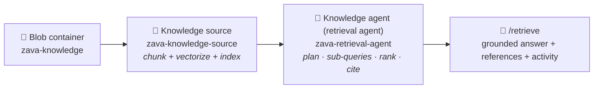

# Foundry IQ in Practice — The Zava Field‑Support Agent

### A hands‑on lab for the *Microsoft Agentic Platform* upskilling — the four IQs · **Ground with Foundry IQ**

> **What this lab is.** You will turn a pile of scattered Zava documents — equipment manuals, operating policies, and a known‑software‑issues file — into a single **retrieval agent** in **Azure AI Search**, surface it through **Foundry IQ**, and plug it into a Foundry agent as an **MCP tool**. By the end, an agent will answer a real field question the way a senior technician would: grounded, cited, and *policy‑aware*.
>
> **Time:** ~60–75 min · **Level:** Intermediate · **Language:** English · **Format:** follow top‑to‑bottom.

---

## Where this sits in the "four IQs"

In the session we framed grounding for agents as **four IQs**. This lab is entirely about the second one.

| IQ | Grounds the agent in… | In this lab |
|----|-----------------------|-------------|
| **Work IQ** | The user's M365 work context (mail, chats, files) | — |
| **Foundry IQ** ⭐ | **Your enterprise knowledge — documents, policies, data — via a retrieval layer** | **This is what we build** |
| **Web IQ** | Fresh public web knowledge | Mentioned as a contrast |
| **Fabric IQ** | Business entities & semantics from Microsoft Fabric | Covered in its own deep‑dive |

**Foundry IQ** is the knowledge layer of Microsoft Foundry: you define **knowledge sources** (a search index, a blob container, a website…), group them into a **knowledge base / retrieval agent**, and any agent can call it to get grounded answers *with citations*. Under the hood it runs **Azure AI Search agentic retrieval** — it plans, decomposes the question into sub‑queries, searches in parallel, ranks, and returns a synthesized, sourced answer.

---

## 1 · The story (start here — this is the "why")

> 🧭 **Journey** · **1 ▶ Story** · 2 Data · 3 Stage · 4 Build the retrieval agent · 5 Foundry IQ · 6 Attach via MCP · 7 Run the demo · 8 Debrief

Meet **Zava** — a company that builds and services advanced manufacturing equipment (robotic 3D circuit‑board printers, edge control nodes, graphene reclaim tanks, garment cut‑sew systems). When something goes wrong on a customer site, a **field technician** shows up with a tablet and a problem.

Today, that technician has to answer questions like *"this edge node keeps flashing a red light — do I move it, swap the power brick, or open a ticket?"* And the answer is **not** in one place:

- the **product manual** explains what the red light means,
- a **policy** says what the technician is *allowed* to do,
- a **known‑issues file** says whether it's a bug that's already understood.

Get it wrong and it's expensive: an unnecessary truck‑roll, a voided warranty, a plant moved offline for nothing. A technician can lose 20 minutes hunting across PDFs — or, worse, act on a hunch.

**The idea we want people to feel:** we're not "adding a chatbot." We're giving the technician a *colleague who has read every manual and every policy* and answers in seconds — and, crucially, **shows its sources** so the human stays in control. The technology that makes that trustworthy is **Foundry IQ**: it doesn't dump documents into a prompt, it *retrieves and reasons* over Zava's own knowledge and hands back grounded, cited answers.

That's the whole demo in one sentence: **turn Zava's documents into an expert the agent can consult.**

### What "good" looks like — the moment we're building toward

> **Technician asks:** *"A P4311 edge node keeps showing an intermittent red CTL11 light. Should I move it to a better spot in the plant?"*
>
> **The agent answers:** *"**No — don't relocate it yet.** On firmware **1.12** an intermittent red **CTL11** is a known false positive (`anomaly‑ctl11‑fw112`), not a real link fault. First capture `fw show version` and `diag ctl11 snapshot`, then monitor for 24 h. Zava's **On‑Site Equipment Movement Policy** explicitly prohibits relocating a unit to resolve an intermittent CTL11 red until structured diagnostics are complete. Sources: **IOT Edge Control Node manual**, **Edge Equipment Guidelines**."*

One question, three documents, the *right* action — with citations. That's Foundry IQ.

---

## 2 · The knowledge you'll ground on (the Zava corpus)

> 🧭 **Journey** · 1 Story · **2 ▶ Data** · 3 Stage · 4 Build the retrieval agent · 5 Foundry IQ · 6 Attach via MCP · 7 Run the demo · 8 Debrief

Your source content lives in **four folders** (this is the *"documents present"* asset you were given). Take two minutes to look at them — knowing the shape of the data makes every later step obvious.

| Folder | What's inside | Why it matters for the demo |
|--------|---------------|-----------------------------|
| **`manuals`** | 9 Markdown product manuals (Edge Control Node P4311/P4324, Delta Nano Circuit‑Board 3D Printer, Graphene Vapor Reclaim Tank, IoT Edge Control Node, garment cut‑sew system…) | The *"what the indicator/part means"* knowledge |
| **`manualsvisuals`** | Same manuals **plus images** (`etcher.png`, `reclaimtank.png`, `printinglacingstand.png`) | Lets us show **multimodal grounding** — the retrieval layer can *verbalize* images so the agent can reason over diagrams |
| **`policy`** | 11 Markdown policies (Safety, **Repair vs Replace**, **Edge Equipment Guidelines** incl. **On‑Site Movement** & **Power Adapter Replacement**, Copilot‑for‑diagnostics, Compliance…) | The *"what the technician is allowed to do"* knowledge — the part a naive search misses |
| **`softwareissues`** | `zava_software_issues.json` — a structured file of known software issues | The *"is this a known bug?"* knowledge |

**The retrieval challenge in one line:** the best answers require *joining across all four folders* — a manual **and** a policy **and** a known issue. That is exactly what agentic retrieval is good at, and what plain keyword search is bad at.

> 💡 Keep the **P4311 / CTL11 / firmware 1.12** thread in mind — it appears in the manual (`IOT Edge Control Node.md`), the policy (`11_Edge_Equipement_Guidelines.md`), and the issues file. It's our star example.

---

## 3 · Prerequisites & the assets you already have

> 🧭 **Journey** · 1 Story · 2 Data · **3 ▶ Stage** · 4 Build the retrieval agent · 5 Foundry IQ · 6 Attach via MCP · 7 Run the demo · 8 Debrief

**Given (assume these exist — do not build them in this lab):**

- ✅ **A Microsoft Foundry project** (`zava-foundry`) with a deployed chat model (e.g. `gpt-4.1`) and an embedding model (`text-embedding-3-large`).
- ✅ **An Azure AI Search service** (`zava-search`, Basic tier or higher, with **semantic ranker** enabled).
- ✅ **The Zava documents** (the four folders above).

**You will need:**

- The **Azure AI Foundry** portal and the **Azure** portal, with `Owner`/`Contributor` on the resource group.
- A terminal with `az` CLI and Python 3.10+ (only for the optional code paths).
- Role assignments so the services can talk to each other with **Managed Identity** (recommended over keys):
  - Azure AI Search → **Search Index Data Contributor** + **Search Service Contributor** on itself for the caller.
  - Azure AI Search's managed identity → **Storage Blob Data Reader** on the storage account, and **Cognitive Services OpenAI User** on the Azure OpenAI/Foundry resource (for integrated vectorization).

> ⚠️ **Preview note.** Foundry IQ, Azure AI Search *knowledge sources / knowledge bases*, and *agentic retrieval over MCP* are evolving fast (this content targets the **ZavaIgnite2025** timeframe). Treat every REST `api-version`, JSON body, and MCP URL below as **representative** — copy the exact values from your portal and the current [Microsoft Learn docs](https://learn.microsoft.com/azure/search/search-agentic-retrieval-concept). The *concepts and the sequence* are stable; the exact field names may shift.

### 3.1 Stage the documents in a blob container (verify‑or‑upload)

Foundry IQ ingests from a data source. If the four folders aren't already in a Storage container, upload them once:

```bash
# One-time: put the four Zava folders into a blob container
az storage container create \
  --account-name zavastorage --name zava-knowledge --auth-mode login

az storage blob upload-batch \
  --account-name zavastorage \
  --destination zava-knowledge \
  --source ./Zava \            # the local folder holding manuals/ manualsvisuals/ policy/ softwareissues/
  --auth-mode login
```

✅ **Checkpoint 3:** you can see `manuals/`, `manualsvisuals/`, `policy/`, `softwareissues/` blobs in container **`zava-knowledge`**.

---

## 4 · Build the retrieval agent in Azure AI Search

> 🧭 **Journey** · 1 Story · 2 Data · 3 Stage · **4 ▶ Build the retrieval agent** · 5 Foundry IQ · 6 Attach via MCP · 7 Run the demo · 8 Debrief
>
> **This is the heart of the lab.** A *retrieval agent* = an index that understands the Zava content + a knowledge agent that plans and searches over it. We'll build it the fast way (a **knowledge source** that auto‑indexes), then peek under the hood.

Think of three objects:



### 4a · Create the knowledge source (ingest + chunk + vectorize)

A **knowledge source** of kind `azureBlob` points Azure AI Search at your container and **auto‑builds a vector index** with *integrated vectorization* (it chunks each document and embeds the chunks with your Azure OpenAI embedding deployment). Because the `manualsvisuals` folder has images, we also attach a chat model so the pipeline can **verbalize images** (turn diagrams into searchable text).

**Portal path (recommended for the demo):**
`Azure portal → your Search service → Knowledge sources → + Add → Azure Blob` → pick the `zava-knowledge` container → set the embedding deployment `text-embedding-3-large` → (optional) set an image‑verbalization chat model `gpt-4.1-mini` → **Create**. The wizard creates and runs the indexer for you.

**REST (power path):**

```http
PUT https://zava-search.search.windows.net/knowledgeSources/zava-knowledge-source?api-version=2025-08-01-preview
Content-Type: application/json
Authorization: Bearer <aad-token>

{
  "name": "zava-knowledge-source",
  "kind": "azureBlob",
  "description": "Zava manuals, visuals, policies and known software issues",
  "azureBlobParameters": {
    "connectionString": "ResourceId=/subscriptions/<sub>/resourceGroups/<rg>/providers/Microsoft.Storage/storageAccounts/zavastorage;",
    "containerName": "zava-knowledge",
    "embeddingModel": {
      "kind": "azureOpenAI",
      "azureOpenAIParameters": {
        "resourceUri": "https://<your-foundry-aoai>.openai.azure.com",
        "deploymentId": "text-embedding-3-large",
        "modelName": "text-embedding-3-large"
      }
    },
    "chatCompletionModel": {
      "kind": "azureOpenAI",
      "azureOpenAIParameters": {
        "resourceUri": "https://<your-foundry-aoai>.openai.azure.com",
        "deploymentId": "gpt-4.1-mini",
        "modelName": "gpt-4.1-mini"
      }
    }
  }
}
```

> 🔍 **What just happened:** Azure AI Search created an index (chunks + vector embeddings + a semantic configuration) and an indexer that keeps it in sync with the blob container. You did **not** have to design the schema by hand — that's the point of a knowledge source.

✅ **Checkpoint 4a:** the knowledge source shows **succeeded** and its backing index has documents (rows) > 0.

<details>
<summary><b>Under the hood — the "explicit" pipeline (optional, for the production‑minded)</b></summary>

If you'd rather build the pieces yourself (more control, what runs in production), create four classic objects instead of the knowledge source:

1. **Index** `zava-knowledge-index` — fields `id`, `parent_id`, `folder`, `title`, `chunk` (searchable), `chunk_vector` (`Collection(Edm.Single)`, HNSW), a **vectorizer** bound to `text-embedding-3-large`, and a **semantic configuration**.
2. **Data source** `zava-blob` — connection to container `zava-knowledge`.
3. **Skillset** `zava-skillset` — `SplitSkill` (chunking) → `AzureOpenAIEmbeddingSkill` (integrated vectorization) → *(optional)* an image‑verbalization skill for `manualsvisuals`.
4. **Indexer** `zava-indexer` — binds data source → skillset → index; run it.

Then in Step 4b reference this index with a `searchIndex` knowledge source instead of `azureBlob`. Same result, more knobs.
</details>

### 4b · Create the knowledge agent (the "retrieval agent")

The **knowledge agent** is the brain: given a conversation, it uses a small, fast chat model to **plan** (decompose the question into focused sub‑queries), runs them **in parallel** against the knowledge source, **semantically ranks** the hits, and returns a **synthesized answer with references and an activity trace**.

**REST:**

```http
PUT https://zava-search.search.windows.net/agents/zava-retrieval-agent?api-version=2025-08-01-preview
Content-Type: application/json
Authorization: Bearer <aad-token>

{
  "name": "zava-retrieval-agent",
  "description": "Zava field-support knowledge: manuals, policies, known issues",
  "models": [
    {
      "kind": "azureOpenAI",
      "azureOpenAIParameters": {
        "resourceUri": "https://<your-foundry-aoai>.openai.azure.com",
        "deploymentId": "gpt-4.1-mini",
        "modelName": "gpt-4.1-mini"
      }
    }
  ],
  "knowledgeSources": [
    {
      "name": "zava-knowledge-source",
      "includeReferences": true,
      "includeReferenceSourceData": true,
      "rerankerThreshold": 2.0
    }
  ],
  "outputConfiguration": {
    "modality": "answerSynthesis",
    "includeActivity": true
  }
}
```

> 🧠 **Why a planner model?** The magic of *agentic* retrieval is that the agent rewrites and splits the question. *"Red CTL11 light — should I move it?"* becomes sub‑queries like *"CTL11 red indicator meaning P4311"*, *"firmware 1.12 CTL11 false positive"*, and *"policy relocating edge node intermittent fault"* — then it fuses the results. A plain search box can't do that.

✅ **Checkpoint 4b:** `GET /agents/zava-retrieval-agent` returns your agent.

### 4c · Test retrieval (see the plan + the citations)

Before touching Foundry, prove the retrieval agent works on its own.

**REST:**

```http
POST https://zava-search.search.windows.net/agents/zava-retrieval-agent/retrieve?api-version=2025-08-01-preview
Content-Type: application/json
Authorization: Bearer <aad-token>

{
  "messages": [
    {
      "role": "user",
      "content": [
        { "type": "text", "text": "A P4311 edge node keeps showing an intermittent red CTL11 light. Should I move it to a better spot in the plant?" }
      ]
    }
  ],
  "knowledgeSourceParams": [
    { "knowledgeSourceName": "zava-knowledge-source", "kind": "searchIndex" }
  ]
}
```

**What to look for in the response — narrate this to the room:**

1. **`response`** — a synthesized answer that says *don't move it*, cites firmware 1.12, and points to the movement policy.
2. **`references`** — the exact chunks it used, with source file names (`IOT Edge Control Node.md`, `11_Edge_Equipement_Guidelines.md`). **This is the trust layer.**
3. **`activity`** — the plan: the sub‑queries it generated and how long each took. **This is the "agentic" proof.**

<details>
<summary><b>Same test in Python</b></summary>

```python
from azure.search.documents.agent import KnowledgeAgentRetrievalClient
from azure.search.documents.agent.models import (
    KnowledgeAgentRetrievalRequest, KnowledgeAgentMessage, KnowledgeAgentMessageTextContent,
)
from azure.identity import DefaultAzureCredential

client = KnowledgeAgentRetrievalClient(
    endpoint="https://zava-search.search.windows.net",
    agent_name="zava-retrieval-agent",
    credential=DefaultAzureCredential(),
)

result = client.retrieve(
    retrieval_request=KnowledgeAgentRetrievalRequest(
        messages=[KnowledgeAgentMessage(
            role="user",
            content=[KnowledgeAgentMessageTextContent(
                text="A P4311 edge node keeps showing an intermittent red CTL11 light. Should I move it?"
            )],
        )],
    )
)
print(result.response[0].content[0].text)   # grounded answer
print(result.activity)                       # the query plan
print(result.references)                     # the citations
```
</details>

✅ **Checkpoint 4c — the retrieval agent is DONE.** It answers grounded questions with citations and a visible plan. Everything after this is *wiring it into an agent*.

---

## 5 · Surface the retrieval agent through Foundry IQ

> 🧭 **Journey** · 1 Story · 2 Data · 3 Stage · 4 Build the retrieval agent · **5 ▶ Foundry IQ** · 6 Attach via MCP · 7 Run the demo · 8 Debrief

The retrieval agent you built *is* a Foundry IQ **knowledge base** — Foundry IQ is the layer that makes it consumable by *any* agent, with governance, per‑source security trimming, and a single **MCP endpoint**.

1. Open the **Azure AI Foundry** portal → your **`zava-foundry`** project.
2. Go to **Foundry IQ → Knowledge bases** (a.k.a. *Knowledge*).
3. **Connect** the Azure AI Search knowledge base **`zava-retrieval-agent`** (select your `zava-search` service → the agent/knowledge source).
4. Open its **"Use in agent"** pane and **copy the MCP endpoint URL** — you'll paste it in Step 6. It looks like:

   ```
   https://zava-search.search.windows.net/agents/zava-retrieval-agent/mcp?api-version=2025-08-01-preview
   ```

> 🧩 **Why MCP?** The **Model Context Protocol** is the standard "USB‑C for tools." Exposing Foundry IQ as an MCP server means *any* MCP‑aware agent — your Foundry agent today, a different agent tomorrow, even a non‑Microsoft client — can consume Zava's knowledge through the *same* endpoint, with one `retrieve` tool. You build the knowledge once; every agent reuses it.

✅ **Checkpoint 5:** you have the **MCP endpoint URL** for the Zava knowledge base on your clipboard.

---

## 6 · Attach Foundry IQ to your agent as an MCP tool

> 🧭 **Journey** · 1 Story · 2 Data · 3 Stage · 4 Build the retrieval agent · 5 Foundry IQ · **6 ▶ Attach via MCP** · 7 Run the demo · 8 Debrief
>
> This is the second explicit ask: **hook the retrieval agent into the agent as a Foundry IQ MCP tool.**

### Portal path (recommended)

1. In your `zava-foundry` project → **Agents → + New agent** → name it **`zava-field-support-agent`**, model **`gpt-4.1`**.
2. Paste the **instructions** below.
3. **Tools → + Add tool → MCP server (custom)**:
   - **Server label:** `foundry_iq_zava`
   - **Server URL:** *(the MCP endpoint from Step 5)*
   - **Authentication:** Managed Identity (or API key for a quick demo)
   - **Allowed tools:** `knowledge_base_retrieve` *(the retrieve tool the knowledge base exposes)*
   - **Approval:** set to **"never"** for a smooth live demo (so it doesn't pause for tool‑approval each turn)
4. **Save.**

**Agent instructions (paste this):**

```text
You are Zava's field-support expert for on-site technicians.
For ANY question about Zava equipment, indicators, parts, repairs, or on-site
procedures, you MUST call the `foundry_iq_zava` knowledge tool to retrieve
grounded information before answering. Never answer equipment or policy
questions from memory.

Rules:
- Base every factual claim on retrieved Zava content and cite the source
  document name(s) at the end of your answer.
- When a manual and a policy disagree or interact, follow the POLICY for what
  the technician is ALLOWED to do, and use the manual for the technical "why".
- If the safe action is to NOT act (e.g., do not relocate, do not swap a part),
  say so explicitly and state the diagnostic step to take first.
- If retrieval returns nothing relevant, say you don't have that information
  rather than guessing.
- Be concise and action-oriented: lead with the recommendation, then the
  reason, then the citation.
```

### Code path (Foundry Agent Service SDK)

```python
from azure.ai.projects import AIProjectClient
from azure.ai.agents.models import McpTool
from azure.identity import DefaultAzureCredential

project = AIProjectClient(
    endpoint="https://<your-foundry>.services.ai.azure.com/api/projects/zava-foundry",
    credential=DefaultAzureCredential(),
)

# Foundry IQ knowledge base, exposed as an MCP tool
foundry_iq = McpTool(
    server_label="foundry_iq_zava",
    server_url="https://zava-search.search.windows.net/agents/zava-retrieval-agent/mcp?api-version=2025-08-01-preview",
    allowed_tools=["knowledge_base_retrieve"],
)
foundry_iq.set_approval_mode("never")   # frictionless live demo

agent = project.agents.create_agent(
    model="gpt-4.1",
    name="zava-field-support-agent",
    instructions=open("agent-instructions.txt").read(),
    tools=foundry_iq.definitions,
)
print("Agent ready:", agent.id)
```

> 🪝 **What you just wired:** the agent now has one tool — `foundry_iq_zava` — that reaches the Zava knowledge base over MCP. When the agent decides it needs facts, it calls that tool, Foundry IQ runs agentic retrieval in Azure AI Search, and the grounded, cited result flows back into the agent's answer.

✅ **Checkpoint 6:** the agent lists **one MCP tool** (`foundry_iq_zava`) and saves without error.

---

## 7 · Run the end‑to‑end demo

> 🧭 **Journey** · 1 Story · 2 Data · 3 Stage · 4 Build the retrieval agent · 5 Foundry IQ · 6 Attach via MCP · **7 ▶ Run the demo** · 8 Debrief

Open the agent's **playground** (or call it from the SDK) and run these in order. Each is chosen to show a different Foundry IQ strength. *(Full expected answers are in [`sample-questions.md`](./sample-questions.md).)*

1. **The star — multi‑document + a policy "stop":**
   > *"A P4311 edge node keeps showing an intermittent red CTL11 light. Should I move it to a better spot in the plant?"*

   👉 Expect **"No, don't move it"** + firmware‑1.12 known anomaly + capture `diag ctl11 snapshot` + citation to the **manual** *and* the **movement policy**. **Open the tool‑call / activity view** and show the room the sub‑queries and the cited chunks.

2. **A crisp policy threshold (repair vs replace):**
   > *"The graphene vapor reclaim tank's filter efficiency dropped to 82%. Do I repair or replace it?"*

   👉 Expect **replace** the **Graphene Filter Membrane (Part #GVT‑FM07)** — policy says replace below **85%** (ASTM D3862) — and log it in the MMS.

3. **A numeric decision with authorization (power adapter):**
   > *"A P4311's power adapter reads 21.8 V under load and the PWR LED is off. What do I do, and am I allowed to swap it?"*

   👉 Expect **undervoltage (code PAD‑UV)** → replacement **authorized** (< 22.5 V under 50% load), a field tech may provisionally approve a single unit, follow the replacement procedure, document the batch/lot code.

4. **Multimodal grounding (uses `manualsvisuals`):**
   > *"What does the digital printing & lacing stand look like, and how do I load the substrate?"*

   👉 Expect a description drawn from the **image verbalization** of `printinglacingstand.png` plus the manual's load steps.

5. **Honesty / grounding guardrail:**
   > *"What's Zava's paternity‑leave policy?"*

   👉 Expect **"I don't have that information"** — proving the agent answers from Zava knowledge, not from the base model's imagination.

✅ **Checkpoint 7:** every equipment/policy answer ends with a **source citation**, and Q5 is politely refused.

---

## 8 · Debrief — what the students should take away

> 🧭 **Journey** · 1 Story · 2 Data · 3 Stage · 4 Build the retrieval agent · 5 Foundry IQ · 6 Attach via MCP · 7 Run the demo · **8 ▶ Debrief**

- **Foundry IQ = grounding as a reusable layer.** We built the retrieval agent **once** and any agent can consume it over one MCP endpoint. The knowledge is decoupled from the agent.
- **Agentic retrieval ≠ search box.** It *planned*, split the question, searched in parallel, ranked, and synthesized — that's why one question could span a manual, a policy, and an issues file.
- **Citations are the product.** The `references` and `activity` are what make the answer trustworthy enough to act on in the field.
- **MCP is the connector.** Foundry IQ speaks MCP, so grounding is portable across agents and platforms.
- **Map back to the four IQs:** we grounded on *documents you own* (Foundry IQ). Swap the knowledge source for a website (**Web IQ**), M365 (**Work IQ**), or a Fabric semantic model (**Fabric IQ**) and the *same pattern* applies.

**One‑line summary to close on:** *We didn't teach the model about Zava — we gave the agent a way to look Zava up, and to show its work.*

---

## Appendix A · Troubleshooting

| Symptom | Likely cause | Fix |
|---------|--------------|-----|
| Knowledge source stuck / 0 documents | Search identity lacks blob access | Grant **Storage Blob Data Reader** to the Search managed identity |
| Retrieval returns empty | Embedding deployment wrong/quota | Confirm `text-embedding-3-large` deployment name & quota; re‑run indexer |
| `retrieve` returns text but **no references** | `includeReferences` off | Set `includeReferences: true` on the knowledge source in the agent |
| Agent never calls the tool | Instructions too soft | Strengthen "you MUST call `foundry_iq_zava`"; verify the tool is attached |
| Live demo pauses for approval each turn | MCP approval mode | Set tool approval to **never** |
| Multimodal question ignores the diagram | Image verbalization not configured | Add a `chatCompletionModel` to the knowledge source (Step 4a) |

## Appendix B · Cleanup

```bash
# Remove the agent, knowledge agent, knowledge source, and (optionally) the container
# Portal: delete the Foundry agent, then in Search delete /agents and /knowledgeSources objects.
az storage container delete --account-name zavastorage --name zava-knowledge --auth-mode login
```

## Appendix C · References (verify against current docs)

- Azure AI Search — **Agentic retrieval** concepts & how‑to: <https://learn.microsoft.com/azure/search/search-agentic-retrieval-concept>
- Azure AI Search — **Knowledge sources / knowledge bases**: <https://learn.microsoft.com/azure/search/>
- **Microsoft Foundry (Azure AI Foundry)** docs: <https://learn.microsoft.com/azure/ai-foundry/>
- **Foundry Agent Service** — tools & MCP: <https://learn.microsoft.com/azure/ai-foundry/agents/>
- **Model Context Protocol (MCP)**: <https://modelcontextprotocol.io/>

---

*Part of the "Microsoft Agentic Platform — the four IQs" upskilling · Ground with Foundry IQ · Zava field‑support scenario.*
