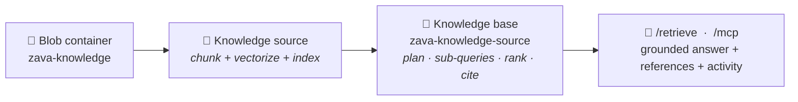

# Foundry IQ in Practice — The Zava Field‑Support Agent

### A hands‑on lab for the *Microsoft Agentic Platform* upskilling — the four IQs · **Ground with Foundry IQ**

> **What this lab is.** You will turn a pile of scattered Zava documents — equipment manuals, operating policies, and a known‑software‑issues file — into a single **knowledge base** in **Azure AI Search**, expose it through **Foundry IQ**, and attach it to a Foundry agent (as **Knowledge**; MCP is the transport under the hood). By the end, an agent will answer a real field question the way a senior technician would: grounded, cited, and *policy‑aware*.
>
> **Time:** ~60–75 min · **Level:** Intermediate · **Language:** English · **Format:** follow top‑to‑bottom.
>
> **📌 Updated (portal‑accurate).** An earlier draft of this lab told you to *copy an MCP endpoint URL from a “Use in agent” pane* and add a *“Foundry IQ” MCP server*. That was based on an older preview. In the current portal, a Foundry IQ **knowledge base** is attached to an agent through **Knowledge** (via **Use in an agent**) — there is no URL to copy and no “Foundry IQ” entry in the MCP‑servers list. MCP is still used *under the hood*, and you can wire it explicitly **in code** (Step 6). Endpoints and API versions below use the current **`2026-05-01-preview`** (agentic retrieval is GA in **`2026-04-01`**).

---

## Where this sits in the "four IQs"

In the session we framed grounding for agents as **four IQs**. This lab is entirely about the second one.

| IQ | Grounds the agent in… | In this lab |
|----|-----------------------|-------------|
| **Work IQ** | The user's M365 work context (mail, chats, files) | — |
| **Foundry IQ** ⭐ | **Your enterprise knowledge — documents, policies, data — via a knowledge base** | **This is what we build** |
| **Web IQ** | Fresh public web knowledge | Mentioned as a contrast |
| **Fabric IQ** | Business entities & semantics from Microsoft Fabric | Covered in its own deep‑dive |

**Foundry IQ** is the knowledge layer of Microsoft Foundry: you define **knowledge sources** (a blob container, a search index, a website, SharePoint…), group them into a **knowledge base**, and any agent can consume that knowledge base to get grounded answers *with citations*. Under the hood it runs **Azure AI Search agentic retrieval** — it plans, decomposes the question into sub‑queries, searches in parallel, ranks, and returns a synthesized, sourced answer.

---

## 1 · The story (start here — this is the "why")

> 🧭 **Journey** · **1 ▶ Story** · 2 Data · 3 Stage · 4 Build the knowledge base · 5 Foundry IQ · 6 Attach to agent · 7 Run the demo · 8 Debrief

Meet **Zava** — a company that builds and services advanced manufacturing equipment (robotic 3D circuit‑board printers, edge control nodes, graphene reclaim tanks, garment cut‑sew systems). When something goes wrong on a customer site, a **field technician** shows up with a tablet and a problem.

Today, that technician has to answer questions like *"this edge node keeps flashing a red light — do I move it, swap the power brick, or open a ticket?"* And the answer is **not** in one place:

- the **product manual** explains what the red light means,
- a **policy** says what the technician is *allowed* to do,
- a **known‑issues file** says whether it's a bug that's already understood.

Get it wrong and it's expensive: an unnecessary truck‑roll, a voided warranty, a plant moved offline for nothing. A technician can lose 20 minutes hunting across PDFs — or, worse, act on a hunch.

**The idea we want people to feel:** we're not "adding a chatbot." We're giving the technician a *colleague who has read every manual and every policy* and answers in seconds — and, crucially, **shows its sources** so the human stays in control. The technology that makes that trustworthy is **Foundry IQ**: it doesn't dump documents into a prompt, it *retrieves and reasons* over Zava's own knowledge and hands back grounded, cited answers.

That's the whole demo in one sentence: **turn Zava's documents into an expert the agent can consult.**

### What "good" looks like — the moment we're building toward

> **Technician asks:** *"A P4311 edge node keeps showing an intermittent red CTL11 light. Should I move it to a better spot in the plant?"*
>
> **The agent answers:** *"**No — don't relocate it yet.** On firmware **1.12** an intermittent red **CTL11** is a known false positive (`anomaly‑ctl11‑fw112`), not a real link fault. First capture `fw show version` and `diag ctl11 snapshot`, then monitor for 24 h. Zava's **On‑Site Equipment Movement Policy** explicitly prohibits relocating a unit to resolve an intermittent CTL11 red until structured diagnostics are complete. Sources: **IOT Edge Control Node manual**, **Edge Equipment Guidelines**."*

One question, three documents, the *right* action — with citations. That's Foundry IQ.

---

## 2 · The knowledge you'll ground on (the Zava corpus)

> 🧭 **Journey** · 1 Story · **2 ▶ Data** · 3 Stage · 4 Build the knowledge base · 5 Foundry IQ · 6 Attach to agent · 7 Run the demo · 8 Debrief

Your source content lives in **four folders** (this is the *"documents present"* asset you were given). Take two minutes to look at them — knowing the shape of the data makes every later step obvious.

| Folder | What's inside | Why it matters for the demo |
|--------|---------------|-----------------------------|
| **`manuals`** | 9 Markdown product manuals (Edge Control Node P4311/P4324, Delta Nano Circuit‑Board 3D Printer, Graphene Vapor Reclaim Tank, IoT Edge Control Node, garment cut‑sew system…) | The *"what the indicator/part means"* knowledge |
| **`manualsvisuals`** | Same manuals **plus images** (`etcher.png`, `reclaimtank.png`, `printinglacingstand.png`) | Lets us show **multimodal grounding** — the knowledge base can *verbalize* images so the agent can reason over diagrams |
| **`policy`** | 11 Markdown policies (Safety, **Repair vs Replace**, **Edge Equipment Guidelines** incl. **On‑Site Movement** & **Power Adapter Replacement**, Copilot‑for‑diagnostics, Compliance…) | The *"what the technician is allowed to do"* knowledge — the part a naive search misses |
| **`softwareissues`** | `zava_software_issues.json` — a structured file of known software issues | The *"is this a known bug?"* knowledge |

**The retrieval challenge in one line:** the best answers require *joining across all four folders* — a manual **and** a policy **and** a known issue. That is exactly what agentic retrieval is good at, and what plain keyword search is bad at.

> 💡 Keep the **P4311 / CTL11 / firmware 1.12** thread in mind — it appears in the manual (`IOT Edge Control Node.md`), the policy (`11_Edge_Equipement_Guidelines.md`), and the issues file. It's our star example.

---

## 3 · Prerequisites & the assets you already have

> 🧭 **Journey** · 1 Story · 2 Data · **3 ▶ Stage** · 4 Build the knowledge base · 5 Foundry IQ · 6 Attach to agent · 7 Run the demo · 8 Debrief

**Given (assume these exist — do not build them in this lab):**

- ✅ **A Microsoft Foundry project** (`zava-foundry`) with a deployed chat model (e.g. `gpt-4.1`), a small planner model (`gpt-4.1-mini`), and an embedding model (`text-embedding-3-large`).
- ✅ **An Azure AI Search service** (`zava-search`, Basic tier or higher, with **semantic ranker** enabled).
- ✅ **The Zava documents** (the four folders above).

**You will need:**

- The **Azure AI Foundry** portal and the **Azure** portal, with `Owner`/`Contributor` on the resource group.
- The latest preview Python SDK (`azure-ai-projects>=2.0.0`) and `az` CLI — only for the optional code paths.
- Role assignments so the services talk to each other with **Managed Identity** (recommended over keys):
  - On the project's parent resource: **Foundry Project Manager** (to create the project connection for MCP) and **Foundry User** (to use the tool in agents). *(These were formerly “Azure AI Project Manager / Azure AI User”.)*
  - The project's **system‑assigned managed identity** → **Search Index Data Reader** on `zava-search` (add **Search Index Data Contributor** only if the agent must write).
  - Azure AI Search's managed identity → **Storage Blob Data Reader** on the storage account, and **Cognitive Services OpenAI User** on the Azure OpenAI/Foundry resource (for integrated vectorization).

> ⚠️ **Preview note.** Foundry IQ, Azure AI Search *knowledge bases*, and *agentic retrieval over MCP* are evolving fast. This lab targets the current **`2026-05-01-preview`** REST API (agentic retrieval is GA in **`2026-04-01`**); the project‑connection call uses the ARM **`2025-10-01-preview`**. Treat every REST body below as **representative** — confirm exact field names against the current [Microsoft Learn docs](https://learn.microsoft.com/azure/foundry/agents/how-to/foundry-iq-connect). The *concepts and the sequence* are stable.

### 3.1 Stage the documents in a blob container (verify‑or‑upload)

Foundry IQ ingests from a data source. If the four folders aren't already in a Storage container, upload them once:

```bash
# One-time: put the four Zava folders into a blob container
az storage container create \
  --account-name zavastorage --name zava-knowledge --auth-mode login

az storage blob upload-batch \
  --account-name zavastorage \
  --destination zava-knowledge \
  --source ./Zava \            # the local folder holding manuals/ manualsvisuals/ policy/ softwareissues/
  --auth-mode login
```

✅ **Checkpoint 3:** you can see `manuals/`, `manualsvisuals/`, `policy/`, `softwareissues/` blobs in container **`zava-knowledge`**.

---

## 4 · Build the knowledge base in Azure AI Search

> 🧭 **Journey** · 1 Story · 2 Data · 3 Stage · **4 ▶ Build the knowledge base** · 5 Foundry IQ · 6 Attach to agent · 7 Run the demo · 8 Debrief
>
> **This is the heart of the lab.** A **knowledge base** = one or more **knowledge sources** (which ingest + vectorize the Zava content) plus the **agentic‑retrieval brain** that plans, searches, ranks, and cites over them. We'll build it the fast way (the Blob wizard auto‑indexes), then peek under the hood.

Think of the objects:



> 🏷️ **About the name.** The Blob wizard creates the knowledge source **and** a knowledge base, and it commonly names the base after the container/source. In this walkthrough (and likely in your tenant) the knowledge base shows up under project **Knowledge** as **`zava-knowledge-source`** — that single object is what you attach to agents. Use whatever name you see; it's the same thing.

### 4a · Create the knowledge base from the blob container (ingest + chunk + vectorize)

The **Azure Blob** knowledge base wizard points Azure AI Search at your container and **auto‑builds a vector index** with *integrated vectorization* (it chunks each document and embeds the chunks with your Azure OpenAI embedding deployment). Because the `manualsvisuals` folder has images, we also attach a chat model so the pipeline can **verbalize images** (turn diagrams into searchable text).

**Portal path (recommended for the demo):**
`Azure portal → your Search service → Knowledge bases → + Create → Azure Blob` → pick the `zava-knowledge` container → set the embedding deployment `text-embedding-3-large` → (optional) set an image‑verbalization chat model `gpt-4.1-mini` → **Create**. The wizard creates the knowledge source, the index + indexer, and the knowledge base (named e.g. `zava-knowledge-source`) for you.

**REST (power path — representative; confirm the schema in current docs):**

```http
PUT https://zava-search.search.windows.net/knowledgeSources/zava-knowledge-source-blob?api-version=2026-05-01-preview
Content-Type: application/json
Authorization: Bearer <aad-token>

{
  "name": "zava-knowledge-source-blob",
  "kind": "azureBlob",
  "description": "Zava manuals, visuals, policies and known software issues",
  "azureBlobParameters": {
    "connectionString": "ResourceId=/subscriptions/<sub>/resourceGroups/<rg>/providers/Microsoft.Storage/storageAccounts/zavastorage;",
    "containerName": "zava-knowledge",
    "embeddingModel": {
      "kind": "azureOpenAI",
      "azureOpenAIParameters": {
        "resourceUri": "https://<your-foundry-aoai>.openai.azure.com",
        "deploymentId": "text-embedding-3-large",
        "modelName": "text-embedding-3-large"
      }
    },
    "chatCompletionModel": {
      "kind": "azureOpenAI",
      "azureOpenAIParameters": {
        "resourceUri": "https://<your-foundry-aoai>.openai.azure.com",
        "deploymentId": "gpt-4.1-mini",
        "modelName": "gpt-4.1-mini"
      }
    }
  }
}
```

> 🔍 **What just happened:** Azure AI Search created an index (chunks + vector embeddings + a semantic configuration) and an indexer that keeps it in sync with the blob container — no hand‑designed schema. In the next sub‑step this knowledge source is wrapped by a **knowledge base**.

✅ **Checkpoint 4a:** the knowledge source shows **succeeded** and its backing index has documents (rows) > 0.

### 4b · Configure the knowledge base (planner model + citations)

The **knowledge base** is the brain: given a conversation, it uses a small, fast chat model to **plan** (decompose the question into focused sub‑queries), runs them **in parallel** against its knowledge source(s), **semantically ranks** the hits, and returns a **synthesized answer with references and an activity trace**. The Blob wizard already created the base; here you confirm/adjust its planner model and that it returns references.

**REST (representative — the portal wizard sets sensible defaults):**

```http
PUT https://zava-search.search.windows.net/knowledgeBases/zava-knowledge-source?api-version=2026-05-01-preview
Content-Type: application/json
Authorization: Bearer <aad-token>

{
  "name": "zava-knowledge-source",
  "description": "Zava field-support knowledge: manuals, policies, known issues",
  "knowledgeSources": [
    {
      "name": "zava-knowledge-source-blob",
      "includeReferences": true,
      "includeReferenceSourceData": true,
      "rerankerThreshold": 2.0
    }
  ],
  "models": [
    {
      "kind": "azureOpenAI",
      "azureOpenAIParameters": {
        "resourceUri": "https://<your-foundry-aoai>.openai.azure.com",
        "deploymentId": "gpt-4.1-mini",
        "modelName": "gpt-4.1-mini"
      }
    }
  ],
  "outputConfiguration": { "modality": "answerSynthesis", "includeActivity": true }
}
```

> 🧠 **Why a planner model?** The magic of *agentic* retrieval is that the base rewrites and splits the question. *"Red CTL11 light — should I move it?"* becomes sub‑queries like *"CTL11 red indicator meaning P4311"*, *"firmware 1.12 CTL11 false positive"*, and *"policy relocating edge node intermittent fault"* — then it fuses the results. A plain search box can't do that.

✅ **Checkpoint 4b:** the knowledge base **`zava-knowledge-source`** exists and lists your blob knowledge source.

### 4c · Test retrieval (see the plan + the citations)

Before touching Foundry, prove the knowledge base works on its own by calling its **`/retrieve`** action directly.

**REST:**

```http
POST https://zava-search.search.windows.net/knowledgeBases/zava-knowledge-source/retrieve?api-version=2026-05-01-preview
Content-Type: application/json
Authorization: Bearer <aad-token>

{
  "messages": [
    {
      "role": "user",
      "content": [
        { "type": "text", "text": "A P4311 edge node keeps showing an intermittent red CTL11 light. Should I move it to a better spot in the plant?" }
      ]
    }
  ]
}
```

**What to look for in the response — narrate this to the room:**

1. **`response`** — a synthesized answer that says *don't move it*, cites firmware 1.12, and points to the movement policy.
2. **`references`** — the exact chunks it used, with source file names (`IOT Edge Control Node.md`, `11_Edge_Equipement_Guidelines.md`). **This is the trust layer.**
3. **`activity`** — the plan: the sub‑queries it generated and how long each took. **This is the "agentic" proof.**

> 🐍 **Prefer code?** The end‑to‑end Python sample [`agentic-retrieval-pipeline-example`](https://github.com/Azure-Samples/azure-search-python-samples) shows the same `/retrieve` call with the current SDK. (Class names in the preview SDK move around — take them from that sample rather than hard‑coding.)

✅ **Checkpoint 4c — the knowledge base is DONE.** It answers grounded questions with citations and a visible plan. Everything after this is *wiring it into an agent*.

---

## 5 · Surface the knowledge base through Foundry IQ

> 🧭 **Journey** · 1 Story · 2 Data · 3 Stage · 4 Build the knowledge base · **5 ▶ Foundry IQ** · 6 Attach to agent · 7 Run the demo · 8 Debrief

The knowledge base you built **is** Foundry IQ — Foundry IQ is the project‑level layer that makes it consumable by *any* agent, with governance and per‑source security trimming.

1. Open the **Azure AI Foundry** portal → your **`zava-foundry`** project.
2. Go to **Knowledge** (project level, *not* inside an agent). Your knowledge base appears here — in this walkthrough it shows as **`zava-knowledge-source`**.
3. Open the knowledge base → **Use in an agent** → **choose your agent** (e.g. `zava-field-support-agent`). Foundry adds the knowledge base to that agent's **Knowledge** section and wires the connection for you. That's it — it works immediately.

> ⚠️ **This corrects an earlier version of this lab.** The portal does **not** give you an MCP URL to copy, and there is **no “Foundry IQ” entry** in the agent's **Tools → MCP servers** list. A Foundry IQ knowledge base is consumed as **Knowledge**; **MCP is only the transport used behind the scenes** (the base exposes a `knowledge_base_retrieve` tool). The connectors you *do* see under Tools — **Azure AI search**, **Work IQ**, **Fabric IQ (OneLake Catalog)**, Grounding with Bing, SharePoint — are *separate* grounding sources for other scenarios.
>
> 👉 The one that looks closest, **“Azure AI search”**, attaches a *plain index* directly (classic vector/keyword search, **no** agentic planning). Use the **knowledge base** (this step) when you want the agentic retrieval + citations we built in Step 4; use the *Azure AI search* tool only for a simple single‑index lookup.

🧩 **Why MCP still matters:** behind the Knowledge attach, the agent reaches the knowledge base over the **Model Context Protocol** with a single `knowledge_base_retrieve` tool. That's why the *same* knowledge base can be reused by a different agent tomorrow — or wired explicitly in code (Step 6, code path). You build the knowledge once; every agent reuses it.

✅ **Checkpoint 5:** your knowledge base **`zava-knowledge-source`** appears inside the agent's **Knowledge** section.

---

## 6 · Attach the knowledge base to your agent

> 🧭 **Journey** · 1 Story · 2 Data · 3 Stage · 4 Build the knowledge base · 5 Foundry IQ · **6 ▶ Attach to agent** · 7 Run the demo · 8 Debrief
>
> Two ways to finish the wiring — the **portal** (Knowledge; recommended, and what you already started in Step 5) and **code** (an explicit MCP tool, for the “attach it as an MCP tool” ask). Both end with the agent calling the knowledge base's `knowledge_base_retrieve` tool over MCP.

### Portal path (recommended — no code)

1. In your `zava-foundry` project → **Agents** → open (or create) **`zava-field-support-agent`**, model **`gpt-4.1`**.
2. Confirm the knowledge base **`zava-knowledge-source`** is listed under the agent's **Knowledge** (from Step 5). If not, add it via **Knowledge → + Add → your knowledge base**.
3. Paste the **instructions** below and **Save**.

**Agent instructions (paste this):**

```text
You are Zava's field-support expert for on-site technicians.
For ANY question about Zava equipment, indicators, parts, repairs, or on-site
procedures, you MUST use the Zava knowledge base to retrieve grounded
information before answering. Never answer equipment or policy questions from
memory.

Rules:
- Base every factual claim on retrieved Zava content and cite the source
  document name(s) at the end of your answer.
- When a manual and a policy disagree or interact, follow the POLICY for what
  the technician is ALLOWED to do, and use the manual for the technical "why".
- If the safe action is to NOT act (e.g., do not relocate, do not swap a part),
  say so explicitly and state the diagnostic step to take first.
- If retrieval returns nothing relevant, say you don't have that information
  rather than guessing.
- Be concise and action-oriented: lead with the recommendation, then the
  reason, then the citation.
```

### Code path (explicit MCP tool — the "attach as an MCP tool" route)

This is the route that literally adds the knowledge base as an **MCP tool**. It's **two objects** (per Microsoft's [current how‑to](https://learn.microsoft.com/azure/foundry/agents/how-to/foundry-iq-connect)):

**① Create a project connection** (`RemoteTool` + `ProjectManagedIdentity`) that targets the knowledge base's MCP endpoint. The endpoint shape is `…/knowledgebases/{name}/mcp` — **not** `/agents/…/mcp`.

```python
import requests
from azure.identity import DefaultAzureCredential, get_bearer_token_provider

credential = DefaultAzureCredential()
project_resource_id = "{project_resource_id}"          # /subscriptions/.../projects/zava-foundry
project_connection_name = "zava-kb-mcp-connection"
mcp_endpoint = "https://zava-search.search.windows.net/knowledgebases/zava-knowledge-source/mcp?api-version=2026-05-01-preview"

arm_token = get_bearer_token_provider(credential, "https://management.azure.com/.default")
requests.put(
    f"https://management.azure.com{project_resource_id}/connections/{project_connection_name}?api-version=2025-10-01-preview",
    headers={"Authorization": f"Bearer {arm_token()}"},
    json={
        "name": project_connection_name,
        "type": "Microsoft.MachineLearningServices/workspaces/connections",
        "properties": {
            "authType": "ProjectManagedIdentity",
            "category": "RemoteTool",
            "target": mcp_endpoint,
            "isSharedToAll": True,
            "audience": "https://search.azure.com/",
            "metadata": {"ApiType": "Azure"}
        }
    },
).raise_for_status()
```

**② Create the agent with an `MCPTool`** that references that connection. The knowledge base exposes exactly one tool: **`knowledge_base_retrieve`** (the only tool currently supported by Foundry Agent Service).

```python
from azure.ai.projects import AIProjectClient
from azure.ai.projects.models import PromptAgentDefinition, MCPTool

project = AIProjectClient(
    endpoint="https://<your-foundry>.services.ai.azure.com/api/projects/zava-foundry",
    credential=credential,
)

mcp_kb_tool = MCPTool(
    server_label="knowledge-base",
    server_url=mcp_endpoint,                      # the /knowledgebases/.../mcp endpoint from ①
    require_approval="never",                     # frictionless live demo
    allowed_tools=["knowledge_base_retrieve"],
    project_connection_id=project_connection_name,
)

agent = project.agents.create_version(
    agent_name="zava-field-support-agent",
    definition=PromptAgentDefinition(
        model="gpt-4.1",
        instructions=open("agent-instructions.txt").read(),
        tools=[mcp_kb_tool],
    ),
)
print("Agent ready:", agent.name)
```

> 🪝 **What you just wired:** the agent now has one MCP tool — `knowledge_base_retrieve`, reached through the `zava-kb-mcp-connection` project connection. When the agent needs facts it calls that tool, the knowledge base runs agentic retrieval in Azure AI Search, and the grounded, cited result flows back into the answer. (The **portal path** above does the same thing without you writing this — the Knowledge attach creates the equivalent connection for you.)

✅ **Checkpoint 6:** in the playground, the agent answers a Zava question and — in the tool‑call trace — you can see it invoked **`knowledge_base_retrieve`**, with the retrieved sources.

---

## 7 · Run the end‑to‑end demo

> 🧭 **Journey** · 1 Story · 2 Data · 3 Stage · 4 Build the knowledge base · 5 Foundry IQ · 6 Attach to agent · **7 ▶ Run the demo** · 8 Debrief

Open the agent's **playground** (or call it from the SDK) and run these in order. Each is chosen to show a different Foundry IQ strength. *(Full expected answers are in [`sample-questions.md`](./sample-questions.md).)*

1. **The star — multi‑document + a policy "stop":**
   > *"A P4311 edge node keeps showing an intermittent red CTL11 light. Should I move it to a better spot in the plant?"*

   👉 Expect **"No, don't move it"** + firmware‑1.12 known anomaly + capture `diag ctl11 snapshot` + citation to the **manual** *and* the **movement policy**. **Open the tool‑call / activity view** and show the room the `knowledge_base_retrieve` call, the sub‑queries, and the cited chunks.

2. **A crisp policy threshold (repair vs replace):**
   > *"The graphene vapor reclaim tank's filter efficiency dropped to 82%. Do I repair or replace it?"*

   👉 Expect **replace** the **Graphene Filter Membrane (Part #GVT‑FM07)** — policy says replace below **85%** (ASTM D3862) — and log it in the MMS.

3. **A numeric decision with authorization (power adapter):**
   > *"A P4311's power adapter reads 21.8 V under load and the PWR LED is off. What do I do, and am I allowed to swap it?"*

   👉 Expect **undervoltage (code PAD‑UV)** → replacement **authorized** (< 22.5 V under 50% load), a field tech may provisionally approve a single unit, follow the replacement procedure, document the batch/lot code.

4. **Multimodal grounding (uses `manualsvisuals`):**
   > *"What does the digital printing & lacing stand look like, and how do I load the substrate?"*

   👉 Expect a description drawn from the **image verbalization** of `printinglacingstand.png` plus the manual's load steps.

5. **Honesty / grounding guardrail:**
   > *"What's Zava's paternity‑leave policy?"*

   👉 Expect **"I don't have that information"** — proving the agent answers from Zava knowledge, not from the base model's imagination.

✅ **Checkpoint 7:** every equipment/policy answer ends with a **source citation**, and Q5 is politely refused.

---

## 8 · Debrief — what the students should take away

> 🧭 **Journey** · 1 Story · 2 Data · 3 Stage · 4 Build the knowledge base · 5 Foundry IQ · 6 Attach to agent · 7 Run the demo · **8 ▶ Debrief**

- **Foundry IQ = grounding as a reusable layer.** We built the knowledge base **once** and attached it to the agent as **Knowledge**; any other agent can reuse the same base. The knowledge is decoupled from the agent.
- **Agentic retrieval ≠ search box.** It *planned*, split the question, searched in parallel, ranked, and synthesized — that's why one question could span a manual, a policy, and an issues file.
- **Citations are the product.** The `references` and `activity` are what make the answer trustworthy enough to act on in the field.
- **MCP is the transport, not a checkbox.** You attach the base as **Knowledge** (portal) — MCP runs underneath (`knowledge_base_retrieve`). If you need it as an explicit tool, wire it in **code** via a project connection. There is no “Foundry IQ” MCP server to pick from a list.
- **Map back to the four IQs:** we grounded on *documents you own* (Foundry IQ). Swap the knowledge source for a website (**Web IQ**), M365 (**Work IQ**), or a Fabric semantic model (**Fabric IQ**) and the *same pattern* applies.

**One‑line summary to close on:** *We didn't teach the model about Zava — we gave the agent a way to look Zava up, and to show its work.*

---

## Appendix A · Troubleshooting

| Symptom | Likely cause | Fix |
|---------|--------------|-----|
| Knowledge source stuck / 0 documents | Search identity lacks blob access | Grant **Storage Blob Data Reader** to the Search managed identity |
| Retrieval returns empty | Embedding deployment wrong/quota | Confirm `text-embedding-3-large` deployment name & quota; re‑run the indexer |
| `/retrieve` returns text but **no references** | `includeReferences` off | Set `includeReferences: true` on the knowledge source in the knowledge base |
| "I don't see a **Foundry IQ** MCP server" | Expected — there isn't one | Attach the knowledge base via **Knowledge → Use in an agent**, not as a custom MCP server. MCP is under the hood. |
| "**Use in an agent** shows no MCP URL to copy" | Expected — the portal wires it for you | Just pick the agent; the base lands in its **Knowledge**. For an explicit MCP tool, use the Step 6 **code path**. |
| Agent never uses the knowledge base | Instructions too soft | Strengthen "you MUST use the Zava knowledge base"; confirm it's in the agent's **Knowledge** |
| Code path: 401/403 from the MCP tool | Project managed identity missing search role | Grant the project MI **Search Index Data Reader** on `zava-search`; connection `audience` = `https://search.azure.com/` |
| Live demo pauses for approval each turn | MCP approval mode | Set `require_approval="never"` (code) / tool approval **never** (portal) |
| Multimodal question ignores the diagram | Image verbalization not configured | Add a `chatCompletionModel` to the knowledge source (Step 4a) |

## Appendix B · Cleanup

```bash
# Portal: delete the Foundry agent; if you used the code path, also delete the project connection.
# In Azure AI Search, delete the knowledge base + knowledge source objects.
# Deleting the agent/connection does NOT delete the knowledge base — remove it separately.
az storage container delete --account-name zavastorage --name zava-knowledge --auth-mode login
```

## Appendix C · References (current docs)

- **Connect a Foundry IQ knowledge base to Foundry Agent Service** (the authoritative how‑to for Steps 5–6): <https://learn.microsoft.com/azure/foundry/agents/how-to/foundry-iq-connect>
- **Connect agents to MCP servers** (the MCP tool): <https://learn.microsoft.com/azure/foundry/agents/how-to/tools/model-context-protocol>
- Azure AI Search — **Agentic retrieval** concepts: <https://learn.microsoft.com/azure/search/search-agentic-retrieval-concept>
- **Microsoft Foundry (Azure AI Foundry)** docs: <https://learn.microsoft.com/azure/ai-foundry/>
- **Model Context Protocol (MCP)**: <https://modelcontextprotocol.io/>

---

*Part of the "Microsoft Agentic Platform — the four IQs" upskilling · Ground with Foundry IQ · Zava field‑support scenario.*
