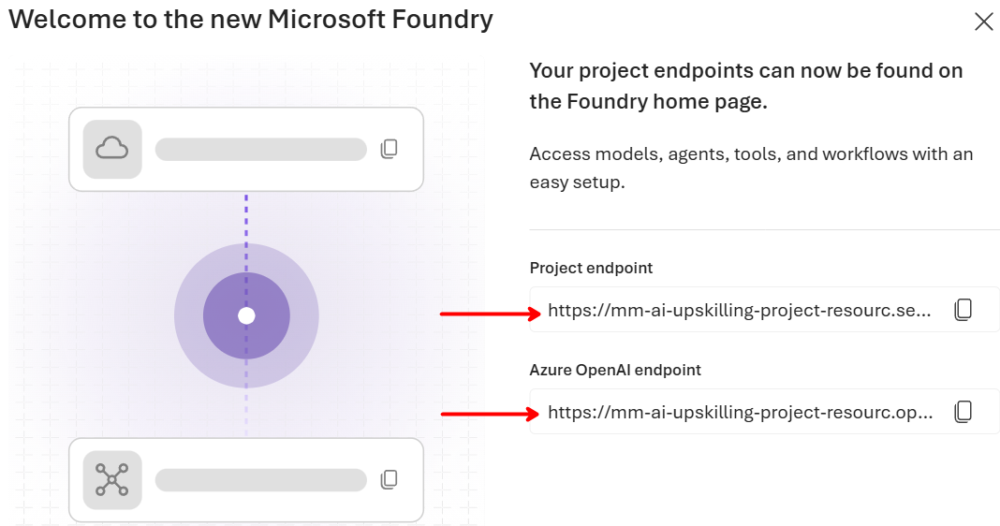
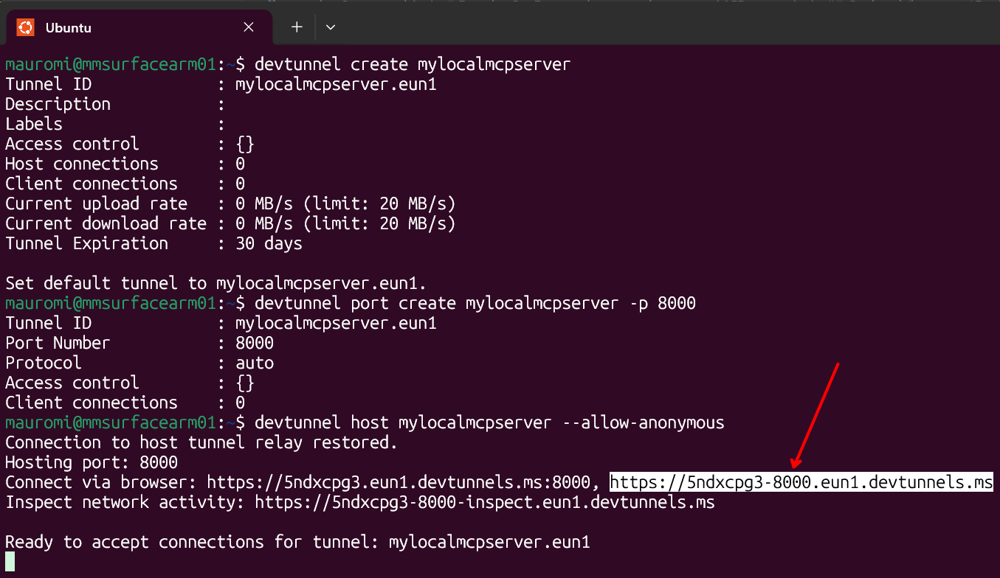

# Environment Preparation

> One-time setup for the hands-on AI labs. Do this **before** your first exercise — the same environment is **shared across every session** in this repository (and by the exercises that will follow).

**Estimated time:** 30–45 minutes · **You do this once.**

---

## 1. Checklist — what you need

- [ ] An **Azure subscription** with permission to create resources (see §2).
- [ ] A **development machine** (physical or VM) with **administrator rights**; Windows users also need **WSL 2 with Ubuntu** (see §3 and §4.1).
- [ ] **Azure CLI**, **Git**, **Visual Studio Code**, and **uv** installed (see §4).
- [ ] A **Python project workspace** with a virtual environment and the dependencies from your session's `requirements.txt` (see §5).
- [ ] Your **secrets/configuration** placed in a local `.env` file (see §7).
- [ ] A **green verification** run (see §8).

> [!TIP]
> If your instructor pre-provisions a shared Azure resource group or a lab tenant, you can skip the resource-creation parts of §2 — confirm with them first.

---

## 2. Azure resources & permissions

You need both **local** tooling and **cloud** access.

| Requirement | Detail |
|-------------|--------|
| Role on a resource group | **Contributor** on your own Azure **Resource Group**, so you can deploy a **Foundry account** and a **Foundry project**. |
| Model deployment | Ability to **deploy a model** in the Foundry project (a chat/reasoning model) — requires quota in the chosen region. |
| Access to use the project | Role **Azure AI User** (or **Azure AI Developer**) on the Foundry project, to use agents and the playground. |
| Region | Pick a region that supports the services used by your session — check with your instructor if unsure. |

> [!NOTE]
> **Foundry account vs project** — the *account* is the top-level Azure resource; the *project* inside it is the container for your models, tools, connections and agent identities. Exercises operate at the **project** level.

---
### 2.1 Create an Microsoft Foundry Resource + Project

First, create a Microsoft Foundry Resource and Project. There are multiple ways to do it -including through Azure-, however the  following example shows how to do it on the [Foundry Portal]( https://ai.azure.com/allResources):


---

After the provisioning, collect the following two pieces of information:


---

, and finally store them as
```bash
AZURE_OPENAI_CHAT_DEPLOYMENT_NAME=<CHAT-DEPLOYMENT-NAME>
FOUNDRY_MODEL_NAME=<CHAT-DEPLOYMENT-NAME>
```
into a the .env file described at [Configure secrets & settings](#7-configure-secrets--settings-env)

---

### 2.2 Create a Deployment

From within the Foundry Project created in the previous step, choose `Build`/`Deployments`/`Deploy a Base Model   ` and create a new deployment, for example `gpt-5.4-mini`:


Add the deployment name to the same .env file created in the previous step:
```
AZURE_OPENAI_CHAT_DEPLOYMENT_NAME=<CHAT-DEPLOYMENT-NAME>
```

---

## 3. Development machine

- **OS:** Windows, macOS, or Linux, with **administrator/sudo rights** (needed to install the tools below).
- **Windows:** use **WSL 2 with Ubuntu** as the lab terminal and Python environment. This gives students the same Linux shell, paths, activation commands, and `uv` workflow.
- **Linux / macOS:** WSL is **not required**. WSL is a Windows compatibility layer for running Linux; these systems already provide a Unix-like development environment directly.
- **Hardware:** any modern laptop/VM; no GPU required (the models run in Azure, not locally).
- **Network:** outbound HTTPS to Azure and to `astral.sh` / `pypi.org` (for uv and packages).

> [!IMPORTANT]
> On Windows, keep the repository and virtual environments in the WSL filesystem (for example, `~/projects/microsoft-ai-upskilling`), not under `/mnt/c`. Run all lab commands from the WSL terminal opened in VS Code.

---

## 4. Install the tooling

### 4.1 Windows only: install WSL 2 and Ubuntu

WSL is required only for Windows students in this workshop. Open **PowerShell as Administrator** and run:

```powershell
wsl --install -d Ubuntu
```

Restart Windows if requested, open **Ubuntu** from the Start menu, and complete the first-run username and password setup. Then update and verify WSL from PowerShell:

```powershell
wsl --update
wsl --status
wsl --list --verbose
```

The `VERSION` column for Ubuntu must show **2**. If an existing distribution still uses version 1, run:

```powershell
wsl --set-default-version 2
wsl --set-version Ubuntu 2
```

Inside the Ubuntu terminal, update the base packages and install Git and `curl`:

```bash
sudo apt update
sudo apt upgrade -y
sudo apt install -y git curl
```

From this point onward, Windows students run every `bash` command in the **WSL Ubuntu terminal**. Linux and macOS students use their normal terminal and skip this section.

### 4.2 Azure CLI + sign in

Install the [Azure CLI](https://learn.microsoft.com/cli/azure/install-azure-cli) in the environment where the labs run:

- **Windows:** install the Linux version inside WSL Ubuntu.
- **Linux:** install the package for your distribution.
- **macOS:** install the macOS package.

Then sign in and select your subscription from that same terminal:

```bash
az login --use-device-code
az account set --subscription "<your-subscription-id-or-name>"
az account show   # confirm the right subscription is active
```

> [!IMPORTANT]
> Most labs authenticate with **`DefaultAzureCredential`**, which reuses your `az login` session — so **no secrets are needed for interactive labs**. Only app-only / "without OBO" exercises need a client ID + secret.

### 4.3 Visual Studio Code

Install [VS Code](https://code.visualstudio.com/) and these extensions:

- **Python** (`ms-python.python`)
- **Jupyter** (`ms-toolsai.jupyter`)
- **WSL** (`ms-vscode-remote.remote-wsl`) — Windows only

On Windows, install VS Code on Windows, open a WSL terminal, navigate to the repository, and run `code .`. Confirm that the bottom-left corner of VS Code shows **WSL: Ubuntu** before continuing.

### 4.4 uv (Python package & project manager)

- **Windows (inside WSL), Linux, and macOS:**
  ```bash
  curl -LsSf https://astral.sh/uv/install.sh | sh
  ```

Close and reopen the terminal if requested by the installer, then verify with `uv --version`. uv also installs and manages Python for you, so you do **not** need a separate Python installation.

> [!NOTE]
> Installing `uv` inside WSL, rather than in Windows PowerShell, ensures that Windows students create Linux virtual environments with the same layout and commands used by Linux and macOS students.
>
> The environments are equivalent in Python version, declared dependencies, and commands. They are not byte-for-byte identical because `uv` may select platform-specific package builds for Linux and macOS.

---

## 5. Create your Python Environment

Run these once per exercise folder, where you find the `requirements.txt` file (like [`01-microsoft-ai-platform/requirements.txt`](01-microsoft-ai-platform/requirements.txt)).

```bash
# 1. Create the project folder and enter it
mkdir my-lab && cd my-lab

# 2. Initialise a uv project on Python 3.13
uv init . --python 3.13

# 3. Create the local virtual environment
uv venv

# 4. Activate it (Windows/WSL, Linux, and macOS)
source .venv/bin/activate

# 5. Install the dependencies (note --active + --prerelease=allow)
uv add --active -r requirements.txt --prerelease=allow

# 6. Confirm what got installed
uv pip list

# 7. (Only when a pyproject.toml already exists) sync the environment
uv sync --active --prerelease=allow

# 8. Deactivate when finished
deactivate
```

> [!NOTE]
> **Why `--prerelease=allow`** — some libraries (e.g. the Microsoft **Agent Framework**) ship as preview releases; this flag lets uv install them. **Why `--active`** — it tells uv to use the virtual environment you just activated.

> [!TIP]
> Alternative to the activate/`--active` flow: prefix any command with `uv run` (e.g. `uv run python app.py`) and uv uses the project environment automatically. Both styles work — pick one and stay consistent.

---

## 6. Jupyter kernel (only for notebook exercises)

Some exercises are delivered as Jupyter notebooks. Register a kernel so VS Code / Jupyter can select this environment. Use a name you'll recognise (here: `ai-labs`).

```bash
# Register the current environment as a kernel
python -m ipykernel install --user --name ai-labs --display-name "AI Labs (uv)"

# List installed kernels
jupyter kernelspec list

# Remove a kernel when no longer needed
jupyter kernelspec uninstall ai-labs
```

In VS Code, open the notebook → **Select Kernel** → choose **"AI Labs (uv)"**.

---

## 7. Configure DevTunnel
### First, run the HTTP server
For example, it might be listening at http://127.0.0.1:8000/mcp

### Install DevTunnel
Run the following: 
- Linux: `curl -sL https://aka.ms/DevTunnelCliInstall | bash` which updates it if already present.
- Windows: `winget install Microsoft.DevTunnel` or `winget upgrade Microsoft.DevTunnel` to just update.
- MAC: `brew install devtunnel` or `brew upgrade devtunnel` to just update.


### Configure DevTunnel for a single run (quicker but the URL changes everytime the tunnel is restarted)
```bash
devtunnel host -p 8000 --allow-anonymous
echo 'export PATH="$HOME/bin:$PATH"' >> ~/.bashrc
source ~/.bashrc
```

### Configure DevTunnel with a permanent (permanent URL - ***recommended***)
```bash
devtunnel user login --entra
devtunnel user show
devtunnel create mylocalmcpserver # una tantum
devtunnel port create mylocalmcpserver -p 8000 # una tantum
devtunnel host mylocalmcpserver --allow-anonymous # every time
```
### As a result...


### Verify DevTunnel installation
`devtunnel --version`

---

## 8. Configure secrets & settings (`.env`)

Keep endpoints and IDs out of your code. Create a `.env` file in the exercise folder and fill in the values your instructor / the Foundry portal give you. Add or remove keys per exercise — this is the reusable baseline:

```bash
# Entra ID (app-only / "without OBO" exercises only)
AZURE_TENANT_ID=<tenant-id>
AZURE_CLIENT_ID=<app-client-id>
AZURE_CLIENT_SECRET=<app-client-secret>

# Foundry project
FOUNDRY_PROJECT_ENDPOINT=<your-project-endpoint>
FOUNDRY_MODEL_NAME=<your-model-deployment-name>
```

Load it in Python with `python-dotenv`:
```python
from dotenv import load_dotenv
import os
load_dotenv()
endpoint = os.environ["FOUNDRY_PROJECT_ENDPOINT"]
```

> [!WARNING]
> **Never commit secrets.** `.env` and `.venv/` are already listed in this repo's [`.gitignore`](.gitignore), so they won't be synchronized into the GitHub repo. However, prefer `DefaultAzureCredential` (from `az login`) over storing secrets whenever the exercise allows it.

---

## 9. Verify your setup

```bash
az account show                                  # correct subscription?
uv pip list | grep -Ei "openai|azure|agent-framework|msal"   # packages present?
```

```bash
uv run python - << 'EOF'
import openai, azure.identity, agent_framework
print("Environment OK:", openai.__name__, azure.identity.__name__, agent_framework.__name__)
EOF
```

You should see **`Environment OK: ...`** with no import errors.

> [!NOTE]
> **Optional** — if a specific exercise starts a local endpoint (e.g. a Responses server on port 8088), you can smoke-test it with:
> ```bash
> curl -sS -X POST http://localhost:8088/responses \
>   -H "Content-Type: application/json" \
>   -d '{"input": "Hello!", "stream": false}'
> ```

---

## Troubleshooting

| Symptom | Likely cause & fix |
|---------|--------------------|
| `uv: command not found` | Reopen the terminal after installing uv (PATH needs refreshing), or re-run the install command. |
| VS Code on Windows cannot find the WSL environment | Install the WSL extension, open the repository with `code .` from Ubuntu, and confirm that VS Code shows **WSL: Ubuntu**. |
| `wsl --install` is unavailable or fails | Install pending Windows updates and confirm that virtualization is enabled; see the [official WSL installation guide](https://learn.microsoft.com/windows/wsl/install). |
| `az login` opens no browser | Use `az login --use-device-code` and follow the code prompt. |
| A preview package fails to resolve | Ensure you pass `--prerelease=allow` to `uv add` / `uv sync`. |
| `import agent_framework` fails | The venv isn't active, or the package didn't install — re-run §5 step 5 inside the activated env. |
| Notebook can't find the kernel | Re-run §6 registration, then re-select the kernel in VS Code. |
| `401` / `403` from Azure | Wrong subscription or missing role — check `az account show` and your **Azure AI User** role on the project. |
| Model deploy fails on quota | Choose a supported region with available quota, or ask your instructor. |

---

## Reference

- Each session lists its own dependencies in its `requirements.txt` (e.g. [`01-microsoft-ai-platform/requirements.txt`](01-microsoft-ai-platform/requirements.txt)).
- Back to the repository index: [README](README.md).
