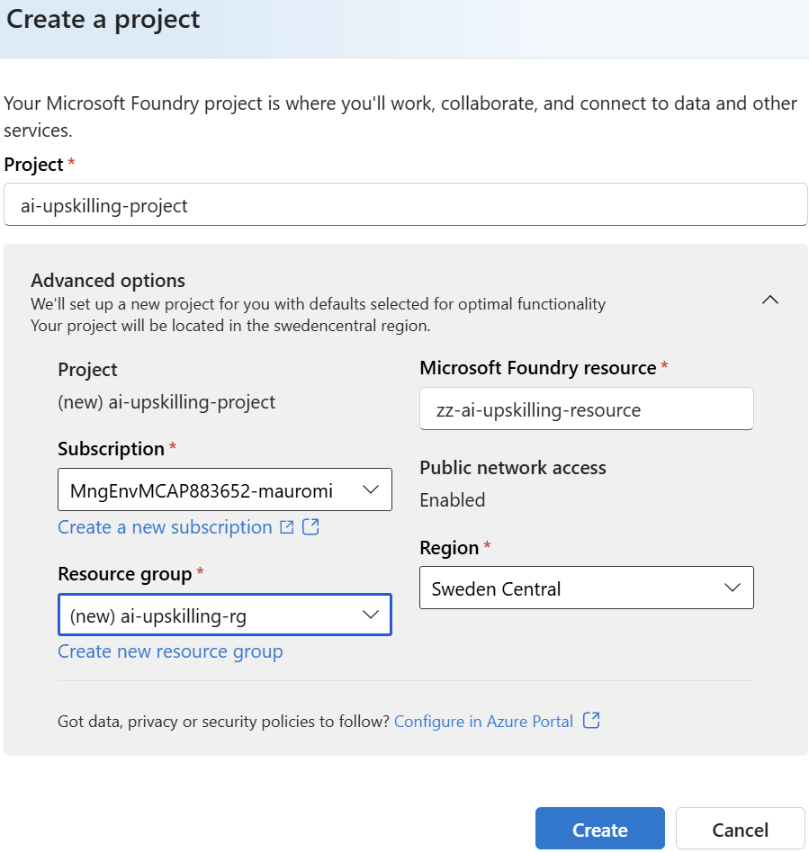
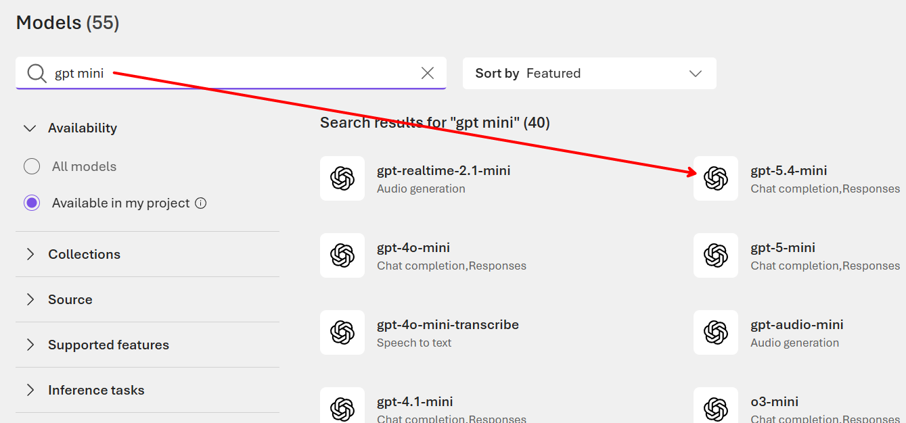

# Environment Preparation

> One-time setup for the hands-on AI labs. Do this **before** your first exercise — the same environment is **shared across every session** in this repository (and by the exercises that will follow).

**Estimated time:** 30–45 minutes · **You do this once.**

---

## 1. Checklist — what you need

- [ ] An **Azure subscription** with permission to create resources (see §2).
- [ ] A **development machine** (physical or VM) with **administrator rights** (see §3).
- [ ] **Azure CLI**, **Git**, **Visual Studio Code**, and **uv** installed (see §4).
- [ ] A **Python project workspace** with a virtual environment and the dependencies from your session's `requirements.txt` (see §5).
- [ ] Your **secrets/configuration** placed in a local `.env` file (see §7).
- [ ] A **green verification** run (see §8).

> [!TIP]
> If your instructor pre-provisions a shared Azure resource group or a lab tenant, you can skip the resource-creation parts of §2 — confirm with them first.

---

## 2. Azure resources & permissions

You need both **local** tooling and **cloud** access.

| Requirement | Detail |
|-------------|--------|
| Role on a resource group | **Contributor** on your own Azure **Resource Group**, so you can deploy a **Foundry account** and a **Foundry project**. |
| Model deployment | Ability to **deploy a model** in the Foundry project (a chat/reasoning model) — requires quota in the chosen region. |
| Access to use the project | Role **Azure AI User** (or **Azure AI Developer**) on the Foundry project, to use agents and the playground. |
| Region | Pick a region that supports the services used by your session — check with your instructor if unsure. |

> [!NOTE]
> **Foundry account vs project** — the *account* is the top-level Azure resource; the *project* inside it is the container for your models, tools, connections and agent identities. Exercises operate at the **project** level.

---
### 2.1 Create an Microsoft Foundry Resource + Project

First, create a Microsoft Foundry Resource and Project. The following example shows how to do it on the [Foundry Portal]( https://ai.azure.com/allResources), but there are multiple ways to do it, including through Azure:


---

After the provisioning, collect the following two pieces of information:


---

, and finally store 
```bash
AZURE_OPENAI_CHAT_DEPLOYMENT_NAME=<CHAT-DEPLOYMENT-NAME>
FOUNDRY_MODEL_NAME=<CHAT-DEPLOYMENT-NAME>
```

into a the .env file described at [Configure secrets & settings](#7-configure-secrets--settings-env): (link to point 7. Configure secrets & settings (.env))

---

### 2.2 Create a Deployment

From within the Foundry Project created in the previous step, choose `Build`/`Deployments`/`Deploy a Base Model   ` and create a new deployment, for example `gpt-5.4-mini`:


Add the deployment name to the same .env file created in the previous step:
```
AZURE_OPENAI_CHAT_DEPLOYMENT_NAME=<CHAT-DEPLOYMENT-NAME>
```

---

## 3. Development machine

- **OS:** Windows, macOS, or Linux, with **administrator/sudo rights** (needed to install the tools below).
- **Hardware:** any modern laptop/VM; no GPU required (the models run in Azure, not locally).
- **Network:** outbound HTTPS to Azure and to `astral.sh` / `pypi.org` (for uv and packages).

---

## 4. Install the tooling

### 4.1 Azure CLI + sign in

Install the [Azure CLI](https://learn.microsoft.com/cli/azure/install-azure-cli), then sign in and select your subscription:

```bash
az login
az account set --subscription "<your-subscription-id-or-name>"
az account show   # confirm the right subscription is active
```

> [!IMPORTANT]
> Most labs authenticate with **`DefaultAzureCredential`**, which reuses your `az login` session — so **no secrets are needed for interactive labs**. Only app-only / "without OBO" exercises need a client ID + secret.

### 4.2 Visual Studio Code

Install [VS Code](https://code.visualstudio.com/) and these extensions:

- **Python** (`ms-python.python`)
- **Jupyter** (`ms-toolsai.jupyter`)

### 4.3 uv (Python package & project manager)

- **Linux / macOS:**
  ```bash
  curl -LsSf https://astral.sh/uv/install.sh | sh
  ```
- **Windows (PowerShell):**
  ```powershell
  powershell -ExecutionPolicy ByPass -c "irm https://astral.sh/uv/install.ps1 | iex"
  ```

Verify: `uv --version`. (uv also installs and manages Python for you — you do **not** need a separate Python install.)

---

## 5. Create your project workspace

Run these once per exercise folder. Grab the `requirements.txt` from the session you are working on (for example [`01-microsoft-ai-platform/requirements.txt`](01-microsoft-ai-platform/requirements.txt)) and copy it into your working folder first.

```bash
# 1. Create the project folder and enter it
mkdir my-lab && cd my-lab

# 2. Initialise a uv project on Python 3.13
uv init . --python 3.13

# 3. Create the local virtual environment
uv venv

# 4. Activate it
source .venv/bin/activate        # Linux / macOS
.\.venv\Scripts\Activate.ps1   # Windows (PowerShell)

# 5. Install the dependencies (note --active + --prerelease=allow)
uv add --active -r requirements.txt --prerelease=allow

# 6. Confirm what got installed
uv pip list

# 7. (Only when a pyproject.toml already exists) sync the environment
uv sync --active --prerelease=allow

# 8. Deactivate when finished
deactivate
```

> [!NOTE]
> **Why `--prerelease=allow`** — some libraries (e.g. the Microsoft **Agent Framework**) ship as preview releases; this flag lets uv install them. **Why `--active`** — it tells uv to use the virtual environment you just activated.

> [!TIP]
> Alternative to the activate/`--active` flow: prefix any command with `uv run` (e.g. `uv run python app.py`) and uv uses the project environment automatically. Both styles work — pick one and stay consistent.

---

## 6. Jupyter kernel (only for notebook exercises, not included here)

Some exercises are delivered as Jupyter notebooks. Register a kernel so VS Code / Jupyter can select this environment. Use a name you'll recognise (here: `ai-labs`).

```bash
# Register the current environment as a kernel
python -m ipykernel install --user --name ai-labs --display-name "AI Labs (uv)"

# List installed kernels
jupyter kernelspec list

# Remove a kernel when no longer needed
jupyter kernelspec uninstall ai-labs
```

In VS Code, open the notebook → **Select Kernel** → choose **"AI Labs (uv)"**.

---

## 7. Configure secrets & settings (`.env`)

Keep endpoints and IDs out of your code. Create a `.env` file in the exercise folder and fill in the values your instructor / the Foundry portal give you. Add or remove keys per exercise — this is the reusable baseline:

```dotenv
# Entra ID (app-only / "without OBO" exercises only)
AZURE_TENANT_ID=<tenant-id>
AZURE_CLIENT_ID=<app-client-id>
AZURE_CLIENT_SECRET=<app-client-secret>

# Foundry project
FOUNDRY_PROJECT_ENDPOINT=<your-project-endpoint>
FOUNDRY_MODEL_NAME=<your-model-deployment-name>
```

Load it in Python with `python-dotenv`:

```python
from dotenv import load_dotenv
import os
load_dotenv()
endpoint = os.environ["FOUNDRY_PROJECT_ENDPOINT"]
```

> [!WARNING]
> **Never commit secrets.** `.env` and `.venv/` are already listed in this repo's [`.gitignore`](.gitignore). Prefer `DefaultAzureCredential` (from `az login`) over storing secrets whenever the exercise allows it.

---

## 8. Verify your setup

```bash
az account show                                  # correct subscription?
uv pip list | grep -Ei "openai|azure|agent-framework|msal"   # packages present?
```

```bash
uv run python - << 'EOF'
import openai, azure.identity, agent_framework
print("Environment OK:", openai.__name__, azure.identity.__name__, agent_framework.__name__)
EOF
```

You should see **`Environment OK: ...`** with no import errors.

> [!NOTE]
> **Optional** — if a specific exercise starts a local endpoint (e.g. a Responses server on port 8088), you can smoke-test it with:
> ```bash
> curl -sS -X POST http://localhost:8088/responses \
>   -H "Content-Type: application/json" \
>   -d '{"input": "Hello!", "stream": false}'
> ```

---

## Troubleshooting

| Symptom | Likely cause & fix |
|---------|--------------------|
| `uv: command not found` | Reopen the terminal after installing uv (PATH needs refreshing), or re-run the install command. |
| `az login` opens no browser | Use `az login --use-device-code` and follow the code prompt. |
| A preview package fails to resolve | Ensure you pass `--prerelease=allow` to `uv add` / `uv sync`. |
| `import agent_framework` fails | The venv isn't active, or the package didn't install — re-run §5 step 5 inside the activated env. |
| Notebook can't find the kernel | Re-run §6 registration, then re-select the kernel in VS Code. |
| `401` / `403` from Azure | Wrong subscription or missing role — check `az account show` and your **Azure AI User** role on the project. |
| Model deploy fails on quota | Choose a supported region with available quota, or ask your instructor. |

---

## Reference

- Each session lists its own dependencies in its `requirements.txt` (e.g. [`01-microsoft-ai-platform/requirements.txt`](01-microsoft-ai-platform/requirements.txt)).
- Back to the repository index: [README](README.md).
